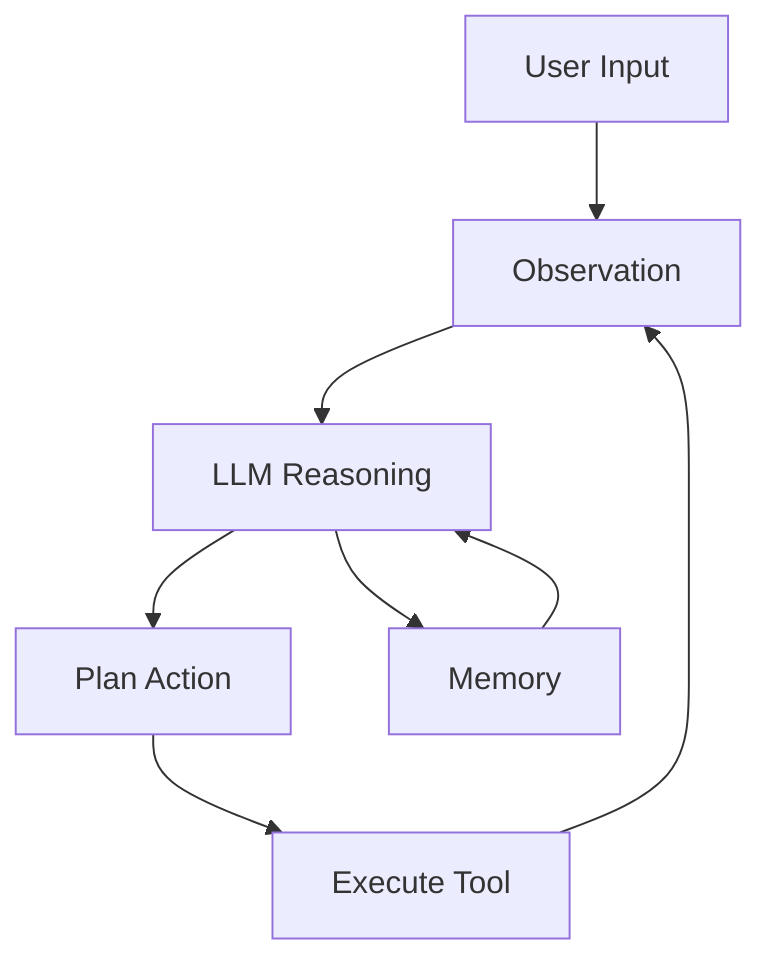

# Agent Framework

LLM agents use large language models to autonomously plan and execute multi-step tasks.

---

## Agent Architecture



---

## ReAct Agent

```python
class ReActAgent:
    def __init__(self, llm, tools):
        self.llm = llm
        self.tools = tools
    
    def step(self, state):
        prompt = f"""Given the current state:
{state}

Available tools:
{self.tool_descriptions}

What should I do next? Think step by step, then take an action.
        
Format:
Thought: ...
Action: tool_name
Action Input: {{"arg": value}}"""
        
        response = self.llm.generate(prompt)
        
        if "Action:" in response:
            tool_name = extract_tool(response)
            tool_args = extract_args(response)
            result = self.tools[tool_name](**tool_args)
            return {"observation": result}
        
        return {"observation": response}
    
    def run(self, task, max_steps=10):
        state = {"task": task, "history": []}
        
        for _ in range(max_steps):
            step = self.step(state)
            state["history"].append(step)
            
            if "final_answer" in step.get("observation", ""):
                return step["observation"]
        
        return "Max steps reached"
```

---

## Memory Systems

```python
class Memory:
    def __init__(self):
        self.short_term = []  # Recent interactions
        self.long_term = []   # Important facts
    
    def add(self, observation):
        # Semantic chunking
        chunks = self.chunk(observation)
        
        for chunk in chunks:
            # Store in appropriate memory
            if self.is_important(chunk):
                self.long_term.append({
                    "content": chunk,
                    "importance": self.score_importance(chunk),
                    "timestamp": time.now()
                })
            else:
                self.short_term.append(chunk)
        
        # Consolidate short to long periodically
        if len(self.short_term) > 10:
            self.consolidate()
    
    def retrieve(self, query, k=5):
        # Retrieve relevant memories
        query_emb = embed(query)
        
        relevant = []
        relevant += self.short_term[-k:]
        relevant += self.long_term.similarity_search(query_emb, k)
        
        return relevant
```

---

## Planning

```python
def plan(agent, task):
    """LLM-based task decomposition"""
    prompt = f"""Task: {task}
    
    Break this down into specific, achievable subtasks.
    Consider dependencies and optimal ordering.
    
    Output format:
    1. [Subtask 1]
    2. [Subtask 2]
    ...
    """
    
    response = agent.llm.generate(prompt)
    return parse_subtasks(response)
```

---

## Agent Types

| Type | Description |
|------|-------------|
| **ReAct** | Reasoning + Acting |
| **Plan-and-Execute** | Decompose, then execute |
| **Reflexion** | Self-reflection on failures |
| **AutoGPT** | Full autonomous loop |
| **BabyAGI** | Task-driven agent |