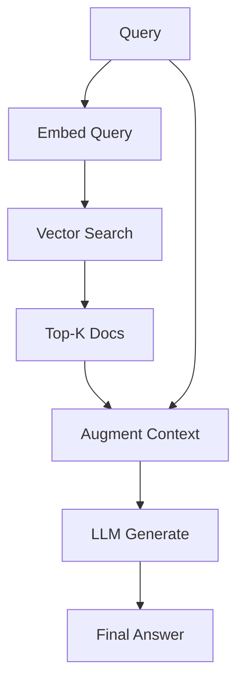

# RAG Retrieval Augmented Generation

RAG augments LLM outputs with retrieved documents for up-to-date, factual responses.

---

## Architecture



---

## Implementation

```python
class RAGPipeline:
    def __init__(self, embedder, retriever, generator):
        self.embedder = embedder
        self.retriever = retriever
        self.generator = generator
    
    def retrieve(self, query, top_k=5):
        query_emb = self.embedder.encode(query)
        docs = self.retriever.search(query_emb, top_k)
        return docs
    
    def generate(self, query, docs):
        context = "\n\n".join([
            f"Document {i+1}: {doc.content}"
            for i, doc in enumerate(docs)
        ])
        
        prompt = f"""Answer based on the following context:
        
Context:
{context}

Question: {query}

Answer:"""
        
        return self.generator.generate(prompt)
    
    def __call__(self, query):
        docs = self.retrieve(query)
        return self.generate(query, docs)
```

---

## Vector Search

```python
class VectorRetriever:
    def __init__(self, index, documents):
        self.index = index  # FAISS, Milvus, etc.
        self.documents = documents
    
    def search(self, query_emb, top_k=5):
        # ANN search
        scores, indices = self.index.search(query_emb.reshape(1, -1), top_k)
        
        results = [self.documents[i] for i in indices[0]]
        return results
```

---

## Hybrid Search

```python
def hybrid_search(query, alpha=0.5):
    # Dense retrieval
    dense_emb = dense_model.encode(query)
    dense_scores = dense_index.search(dense_emb)
    
    # Sparse retrieval (BM25)
    sparse_scores = bm25.retrieve(query)
    
    # RRF fusion
    fused_scores = {}
    for doc_id, score in dense_scores.items():
        fused_scores[doc_id] = alpha * score + (1-alpha) * sparse_scores.get(doc_id, 0)
    
    return sorted(fused_scores.items(), key=lambda x: -x[1])[:top_k]
```