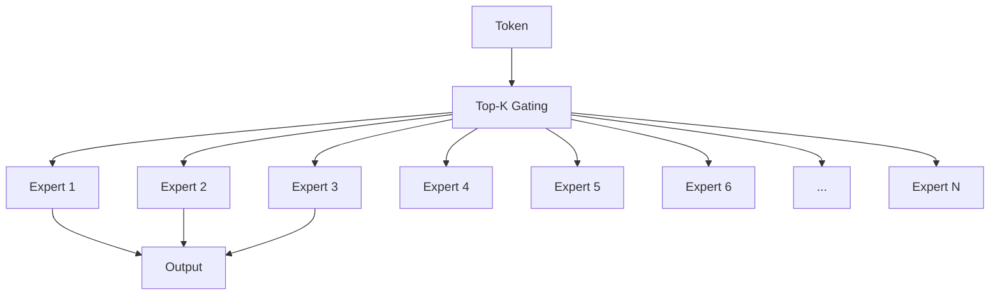

# MoE Mixed Experts

MoE allows massive model capacity with constant compute by activating only a subset of experts per token.

---

## Architecture



---

## Top-K Gating

```python
class MoELayer(nn.Module):
    def __init__(self, d_model, num_experts, top_k):
        super().__init__()
        self.gate = nn.Linear(d_model, num_experts)
        self.experts = nn.ModuleList([FFN() for _ in range(num_experts)])
        self.top_k = top_k
    
    def forward(self, x):
        gate_logits = self.gate(x)
        weights, indices = torch.topk(gate_logits, self.top_k, dim=-1)
        weights = F.softmax(weights, dim=-1)
        
        output = zeros_like(x)
        for i, expert in enumerate(self.experts):
            mask = indices == i
            if mask.any():
                output[mask] += expert(x[mask]) * weights[mask]
        
        return output
```

---

## Why MoE?

| Metric | Dense 70B | MoE 70B (8 experts) |
|--------|-----------|---------------------|
| **Active params** | 70B | 8-9B per token |
| **Compute** | 70B FLOPs | 8-9B FLOPs |
| **Memory** | 140GB | ~20GB active |
| **Quality** | Baseline | Comparable |

---

## Famous MoE Models

| Model | Experts | Top-K | Notes |
|-------|---------|-------|-------|
| **Mixtral 8x7B** | 8 | 2 | Most famous open MoE |
| **DBRX** | 16 | 4 | Databricks |
| **Swallow-MX** | 16 | 2 | Academic |
| **Qwen-MoE** | 64 | 8 | Alibaba |