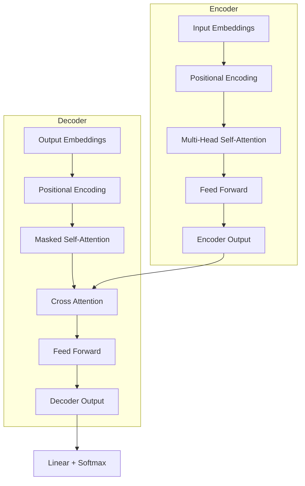

# Transformer Architecture

The Transformer architecture, introduced in "Attention Is All You Need" (Vaswani et al., 2017), revolutionized natural language processing and became the foundation for modern LLMs.

---

## Architecture Overview

---

## Key Components

| Component | Purpose |
|----------|---------|
| **Positional Encoding** | Inject sequence position information |
| **Self-Attention** | Model dependencies between all positions |
| **Feed Forward** | Non-linear transformation per position |
| **Layer Norm** | Stabilize training |
| **Residual Connections** | Enable deep networks |

---

## Complexity

| Aspect | Complexity |
|--------|-----------|
| **Self-attention** | O(n²d) time, O(n²) memory |
| **Feed forward** | O(nd²) time and space |
| **Sequential operations** | O(n) (parallelizable) |