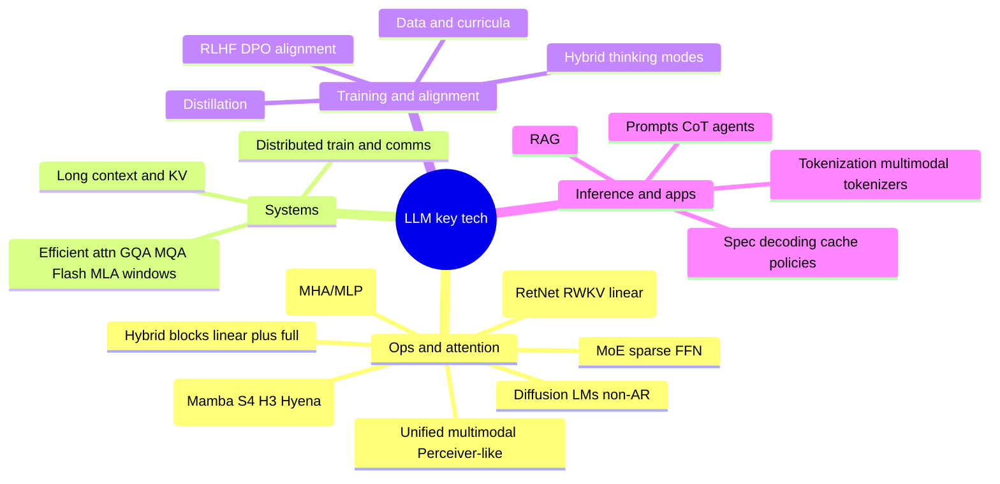

# Architecture landscape beyond Transformer and MoE

Families worth tracking **besides** dense Transformer backbones and MoE sparse FFNs: long-sequence operators, attention variants, non-autoregressive language modeling, unified multimodal bottlenecks, and engineering layers that decide deployability.

## Mindmap

---

## 1. State-space / linear-RNN line (Mamba, S4, H3, Hyena)

- **Idea**: State transitions, long convolutions, or hierarchical convs replace **O(N²)**-style global attention for many layers.  
- **Train**: Often parallel (conv form); **infer**: fixed-state recurrence—good for streaming and very long contexts.  
- **Deployment**: Frequently **partial layer substitution**, not a full architecture swap.  
- **Tradeoff**: Ecosystem maturity; some “slot” or retrieval-heavy tasks still benefit from **some full attention** or external retrieval.

## 2. New attention variants: RetNet, RWKV, linear attention

- **RetNet**: Retention-style mechanism with parallel training and RNN-like inference modes.  
- **RWKV**: Linear-attention-style recurrence with parallel-friendly training.  
- **Linear attention**: Kernel factorizations or rearrangements approximating softmax attention at lower asymptotic cost—usually **mixed** with a few full-attention layers.

## 3. Hybrid stacks (linear + full)

- **Why**: Linear blocks handle **length and cost**; full attention handles **fine alignment and coreference**.  
- **Practice**: Public large models describe **fixed periods** (e.g. one full-attention layer every *k* linear layers) or different linear:full ratios; optimal mix is data- and eval-dependent.

## 4. Diffusion language models (DLM)

- **Idea**: Denoise discrete token sequences—tends toward **non-autoregressive, parallel multi-step** generation.  
- **Status**: Active research; production LMs still mostly autoregressive—watch for niche generation patterns.

## 5. Unified multimodal (Perceiver IO and kin)

- **Idea**: Map all modalities to a **shared token stream** or **small latent bottleneck**, process with a shared Transformer stack, decode to any modality.  
- **Related**: VQ-VAE/VQGAN tokenization into LMs; **unified tokenizers** shrinking the vision–language vocabulary gap.

## 6. Efficient-attention engineering

| Direction | Examples | Effect |
| :--- | :--- | :--- |
| **MQA / GQA** | Shared or grouped K/V | Smaller KV cache |
| **MLA-style** | Low-rank latent K/V | Memory at inference |
| **FlashAttention** | Tiled, SRAM-aware | Speed and VRAM |
| **Windowed / sparse** | Local + global tokens | Long-doc near-linear |

## 7. Non-architecture systems work

- **RAG**: Authz, freshness, multi-hop, layered memory.  
- **Alignment**: RLHF, DPO, process supervision.  
- **Distillation / quantization / pruning**: Edge and cost.  
- **Hybrid thinking**: Same weights route between short answers and long CoT.  
- **Tokenization**: BPE, SentencePiece, visual discrete codes—often the real source of multimodal bugs.

## 8. Where these lines sit

- **Tier 1 (industrial default)**: Transformer + optional MoE + Flash / GQA / MLA-class tricks.  
- **Tier 2 (fast growth)**: **Hybrid linear+full**, **SSM/Mamba inserts**, stronger unified multimodal, world-model + embodied data loops.  
- **Kit**: RAG, alignment, memory hierarchies, tokenizers, inference scheduling—what makes stacks **usable** in production.

If you care more about **low-level implementation** (routers, load balance, linear-attn kernels) vs **agents and tooling**, pair this page with the **[2026 stack checklist](/en/agi/stack)**.
