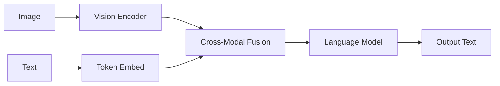

# VLM Vision Language Models

VLMs combine visual encoders with language models for multimodal understanding.

---

## Architecture Types



---

## Two Common Approaches

### 1. Cross-Attention (Flamingo-style)

```python
class FlamingoBlock(nn.Module):
    def __init__(self, lm_dim, vision_dim, num_heads=8):
        super().__init__()
        self.cross_attn = CrossAttention(
            query_dim=lm_dim,
            key_dim=vision_dim,
            num_heads=num_heads
        )
    
    def forward(self, x, image_emb):
        # x: text hidden states
        # image_emb: from vision encoder
        return self.cross_attn(x, image_emb)
```

### 2. Direct Projection (LLaVA-style)

```python
class LLaVA(nn.Module):
    def __init__(self, vision_encoder, lm):
        super().__init__()
        self.vision_encoder = vision_encoder
        self.projector = nn.Linear(vision_dim, lm_dim)
    
    def forward(self, image, text):
        image_emb = self.vision_encoder(image)
        image_emb = self.projector(image_emb)
        
        # Concatenate with text embeddings
        text_emb = self.lm.get_input_embeddings()(text)
        combined = torch.cat([image_emb, text_emb], dim=1)
        
        return self.lm(inputs_embeds=combined)
```

---

## Training Stages

| Stage | What | Data |
|-------|------|------|
| **Pre-training** | Projector only | Image-text pairs |
| **Fine-tuning** | Full model | Instruction data |

---

## Famous VLMs

| Model | Vision Encoder | LLM | Notes |
|-------|---------------|-----|-------|
| **LLaVA** | CLIP | Vicuna | Open source |
| **InstructBLIP** | Various | Vicuna | Instruction-tuned |
| **GPT-4V** | Propietary | GPT-4 | Best quality |
| **Gemini** | Proprietary | Gemini | Google |
| **Qwen-VL** | Qwen | Qwen | Alibaba |