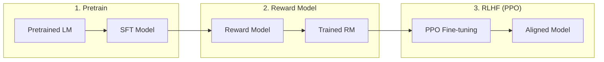

# RLHF

RLHF (Ouyang et al., 2022) aligns models with human preferences using reinforcement learning.

---

## Three Stage Process



---

## Reward Model

```python
class RewardModel(nn.Module):
    def __init__(self, base_model):
        super().__init__()
        self.base = base_model
        self.value_head = nn.Linear(config.hidden_size, 1)
    
    def forward(self, input_ids, attention_mask=None):
        outputs = self.base(input_ids, attention_mask=attention_mask)
        # Use last token's hidden state
        last_hidden = outputs.last_hidden_state[:, -1, :]
        reward = self.value_head(last_hidden)
        return reward

def train_reward_model(pairs):
    """
    pairs: [(chosen_response, rejected_response), ...]
    """
    # Compute reward for both
    r_chosen = reward_model(chosen)
    r_rejected = reward_model(rejected)
    
    # Bradley-Terry loss
    loss = -log_sigmoid(r_chosen - r_rejected)
    return loss.mean()
```

---

## PPO Fine-tuning

```python
def rlhf_train(sft_model, reward_model, prompt_data):
    ref_model = copy.deepcopy(sft_model)  # For KL penalty
    
    for batch in dataloader(prompt_data):
        # Generate response
        response = sft_model.generate(batch)
        
        # Compute rewards
        rewards = reward_model(response)
        
        # KL penalty against SFT
        kl_penalty = kl_divergence(sft_model, ref_model, response)
        
        # PPO update
        for _ in range(config.ppo_epochs):
            log_probs = sft_model.get_log_probs(response)
            
            # Surrogate loss
            ratio = torch.exp(log_probs - old_log_probs)
            surr1 = ratio * advantages
            surr2 = clip(ratio, 1-eps, 1+eps) * advantages
            loss = -min(surr1, surr2) + kl_penalty
            
            loss.backward()
            optimizer.step()
```

---

## Key Parameters

| Parameter | Typical Value |
|-----------|---------------|
| **PPO epochs** | 4 |
| **Clip range** | 0.2 |
| **KL coefficient** | 0.1 |
| **Value coefficient** | 0.5 |
| **Entropy coefficient** | 0.01 |