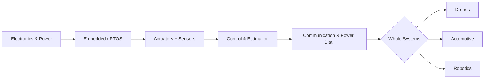

# Hardware path

The goal is not to copy an open-source flight controller and start soldering from day one. Instead, knowledge is organized into **graduated台阶**: first learn to read circuits and understand safety margins, then run real-time logic on an MCU, and only then place multirotor aircraft, vehicles, and robot arms into the same system diagram. The three **whole systems** — **drones, automotive, and consumer/industrial robotics** — share most of the same foundation (electronics, embedded, sensors, control); their differences lie mainly in **dynamics, regulations, and system-level reliability**.

**Sidebar structure:** **Level 1** — **Overview**, **Foundations**, **Progression**, **Systems**. **Foundations** has a “six topics” group with numbered ①–⑥ chapters. **Progression** has an intro plus the interactive **[Mastery roadmap](/en/hardware/progression/roadmap)**. **Systems** has three platforms, each with “deep dives” and level-3 pages.

---

## Three-stage overview

| Stage | What you are learning | Mental model |
|-------|------------------------|---------------|
| **Foundation** (底座) | Circuits, MCU, motors, IMU, PID, CAN/SPI | “How do signals and energy flow reliably?” |
| **Progression** (扩展) | Self-check map across math, mechanics, algorithms, and engineering — 11-layer checklist | “Which benches do I still have gaps in?” |
| **Subsystem integration** (集成) | ESC + propellers, steering + braking, joint modules | “How are forces and motion calculated and bounded?” |
| **Whole systems** (整机) | Flight control stack, domain controllers & functional safety, arms/AGV | “Failure modes and regulatory standards” |

---

## How the eleven layers map to this site

The table below connects the 11-layer roadmap (L0–L10) to the corresponding site chapters, linking the roadmap checklist with actual page reading.

| Roadmap layer | Site chapter |
|--------------|--------------|
| Ⅰ · Math foundations | [Programming & Timeline](/en/timeline) (external textbooks for calculus / linear algebra / probability) |
| ② · Electronics | [Circuits & Electronics](/en/hardware/basics/electronics) |
| ③ · Embedded & MCU | [Embedded & MCUs](/en/hardware/basics/embedded) |
| ④ · Sensors & Perception | [Sensors & Perception](/en/hardware/basics/sensing) |
| ⑤ · Actuators & Power | [Actuators & Power](/en/hardware/basics/actuation) |
| ⑥ · Control & Estimation | [Control & Estimation](/en/hardware/basics/control) |
| ⑦ · Buses & Communication | [Buses & Communication](/en/hardware/basics/communication) |
| ⑧ · Mechanical Design | [Drones · airframe](/en/hardware/systems/drones/airframe), [Automotive · chassis](/en/hardware/systems/automotive/by_wire) |
| ⑨ · AI & Algorithms | [Software overview](/en/software/overview), [AI models](/en/ais/overview), [Datasets](/en/datasets/overview) |
| ⑩ · Systems Integration | [Drones](/en/hardware/systems/drones), [Automotive](/en/hardware/systems/automotive), [Robotics](/en/hardware/systems/robotics) |
| ⑪ · Engineering Practice | [Drones · link & safety](/en/hardware/systems/drones/link_safety), [Automotive · ADAS](/en/hardware/systems/automotive/adas), [Robotics · integration](/en/hardware/systems/robotics/integration) (functional safety / certification / testing) |

---

## Recommended reading order

### Level 1 — Foundations (sub-pages)

1. [Foundations intro](/en/hardware/basics)
2. [Circuits & Electronics](/en/hardware/basics/electronics)
3. [Embedded & MCUs](/en/hardware/basics/embedded)
4. [Actuators & Power](/en/hardware/basics/actuation)
5. [Sensors & Perception](/en/hardware/basics/sensing)
6. [Control & Estimation](/en/hardware/basics/control)
7. [Buses & Communication](/en/hardware/basics/communication)

### Level 1 — Progression

1. [Progression intro](/en/hardware/progression)
2. [Full mastery roadmap](/en/hardware/progression/roadmap) — 11-layer checklist with site chapter mapping

### Level 1 — Systems (sub-pages + level-3)

- [Systems intro](/en/hardware/systems)
- [Drones](/en/hardware/systems/drones) → airframe / flight control / link & safety
- [Automotive](/en/hardware/systems/automotive) → networks / by-wire / ADAS
- [Robotics](/en/hardware/systems/robotics) → manipulators / mobile base / integration & safety

---

## How this integrates with other site sections

- **Programming basics**: [Programming language timeline](/en/timeline)
- **AI / simulation experiments**: [AI models](/en/ais/overview), [AI datasets](/en/datasets/overview)
- **Industry perspective**: [Tech giants](/en/companies/overview)

---

## Realism memo

- **From zero to “a prototype that spins/flies”**: Achievable in months; the key is iteration and measurement.
- **From prototype to a product you can sell or put on the road**: Involves **supply chain, testing, certification, and functional safety** beyond pure engineering knowledge. This path gives you the engineering semantics first — add those additional modules as your product goals solidify.

---

## Extended reading

Chinese full narrative: [ /zh/hardware/overview ](/zh/hardware/overview).
