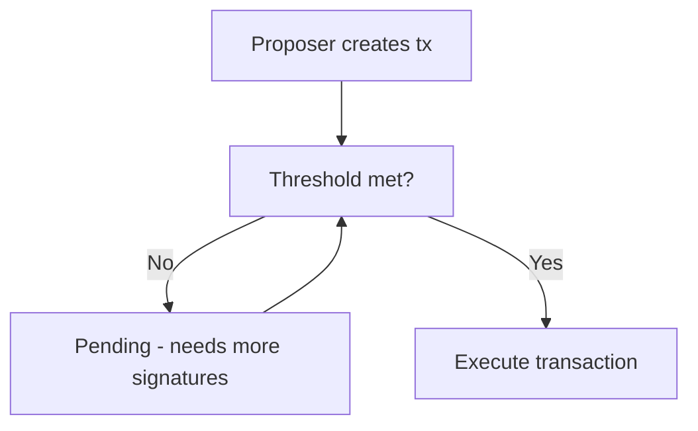

# Multi-Signature Wallets

Multi-signature (multi-sig) wallets require multiple private keys to authorize a transaction. They are essential for DAO treasuries, institutional custody, and any scenario where no single person should have complete control.

---

## How multi-sig works

### M-of-N configuration

```
3-of-5 wallet:
├── Requires ANY 3 of 5 signers
├── 5 total private keys exist
└── 10 possible combinations (C(5,3) = 10)

4-of-7 wallet:
├── Requires ANY 4 of 7 signers
├── 35 possible combinations (C(7,4) = 35)
└── Higher security, more coordination
```

### Transaction flow



---

## Gnosis Safe contract architecture

```solidity
contract GnosisSafe {
    // Required confirmations
    uint256 public threshold;
    
    // List of owners
    address[] public owners;
    
    // Nonce to prevent replay
    uint256 public nonce;
    
    // Transaction hash
    bytes32 public currentTxHash;
    
    // Mapping of owner to index
    mapping(address => uint256) ownerIndex;
    
    function execTransaction(
        address to,
        uint256 value,
        bytes memory data,
        Enum.Operation operation,
        uint256 safeTxGas,
        uint256 baseGas,
        uint256 gasPrice,
        address gasToken,
        address refundReceiver,
        bytes memory signatures
    ) public returns (bool success) {
        bytes32 txHash = getTransactionHash(
            to, value, data, operation, safeTxGas, 
            baseGas, gasPrice, gasToken, refundReceiver, nonce
        );
        
        // Check signatures
        checkSignatures(txHash, signatures);
        
        nonce++;
        // Execute...
    }
    
    function checkSignatures(bytes32 dataHash, bytes memory signatures) internal {
        require(signatures.length >= threshold * 65, "not enough signers");
        
        // Validate each signature
        for (uint i = 0; i < threshold; i++) {
            address signer = recoverSigner(dataHash, signatures, i);
            require(isOwner(signer), "invalid signer");
        }
    }
}
```

---

## Multi-sig use cases

### DAO treasuries

```
Uniswap DAO:
├── 7-of-9 multi-sig (Gnosis Safe)
├── Signers: Community electees
├── Controls: ~$3B in tokens
└── Actions: Grants, investments, emergencies
```

### Institutional custody

```
Family Office:
├── 3-of-5 multi-sig
├── Keys distributed:
│   ├── 1: Primary (bank safe deposit)
│   ├── 2: Secondary (lawyer)
│   ├── 3: Trusted family member
│   ├── 4: Advisor
│   └── 5: Cold backup (metal plate)
└── 48-hour time lock for large txs
```

### Development team funds

```
Startup:
├── 2-of-3 multi-sig
├── Keys:
│   ├── CEO laptop
│   ├── CFO laptop
│   └── External escrow
└── Prevents single point of compromise
```

---

## Timelock guards

Many multi-sigs include time delays for added security:

```solidity
contract TimelockedMultiSig {
    uint256 public constant DELAY = 2 days;
    uint256 public constant GRACE_PERIOD = 14 days;
    
    struct PendingTransaction {
        uint256 eta;           // When it becomes executable
        address target;
        uint256 value;
        bytes data;
        bool executed;
    }
    
    mapping(bytes32 => PendingTransaction) public queuedTxs;
    
    function queue(
        address target,
        uint256 value,
        bytes memory data
    ) public returns (bytes32 txHash) {
        require(isOwner(msg.sender), "not owner");
        
        txHash = keccak256(abi.encode(target, value, data, nonce));
        uint256 eta = block.timestamp + DELAY;
        
        queuedTxs[txHash] = PendingTransaction({
            eta: eta,
            target: target,
            value: value,
            data: data,
            executed: false
        });
    }
    
    function execute(bytes32 txHash) public {
        PendingTransaction storage tx = queuedTxs[txHash];
        require(block.timestamp >= tx.eta, "not yet");
        require(block.timestamp <= tx.eta + GRACE_PERIOD, "expired");
        
        tx.executed = true;
        (bool success, ) = tx.target.call.value(tx.value)(tx.data);
        require(success, "execution failed");
    }
}
```

---

## Multi-sig vs Smart Contract Wallets

| Feature | Multi-sig | Smart Contract Wallet |
|---------|-----------|----------------------|
| **Security model** | N-of-M keys | Code logic + guardians |
| **Social recovery** | No (multisig only) | Yes (guardian set) |
| **Flexibility** | Fixed threshold | Programmable rules |
| **Gas cost** | Higher (multiple sigs) | Lower (single tx) |
| **EVM compatibility** | Native | Requires ERC-4337 |
| **Examples** | Gnosis Safe | Argent, Safe (with 4337) |

---

## Safe (formerly Gnosis Safe) specs

| Metric | Value |
|--------|-------|
| **Deployments** | 100K+ safes |
| **TVL** | ~$50B |
| **Supported chains** | 20+ |
| **Threshold range** | 1-of-1 to 15-of-15 |
| **Modules** | Unlimited extensibility |