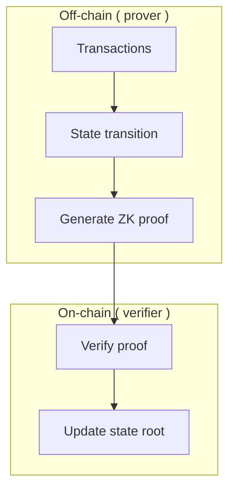

# ZK-SNARKs

ZK-SNARKs (Zero-Knowledge Succinct Non-interactive ARguments of Knowledge) are the most widely deployed zero-knowledge proof system in blockchain, powering Zcash, zkSync, StarkEx, and most ZK-rollups.

---

## The math behind SNARKs

### Polynomial commitments

SNARKs rely on polynomial commitments:

```text
Given: P(x) is a polynomial of degree d

Commitment: C = g^P(s) where g is a generator and s is a secret point

Proof: Prove that P(s) = y without revealing s
```

### Quadratic arithmetic programs (QAP)

Any computation can be converted to a QAP:

```text
Given arithmetic circuit:
    a * b = c
    c + d = e

Convert to polynomial constraints
Convert to QAP
Convert to SRS (Structured Reference String)
```

---

## Trusted setup ceremony

ZK-SNARKs require a "trusted setup" — a ceremony where initial parameters are generated.

### Why trusted setup?

```
Random values (toxic waste) must be discarded:
    τ = random()
    α = random()
    
If τ is not destroyed, attacker can create fake proofs.

If α is not destroyed, attacker can create fake proofs.
```

### Multi-party computation (MCP)

```
Party 1: contributes (τ₁, α₁) → discards immediately
Party 2: contributes (τ₂, α₂) → discards immediately
...
Party N: contributes (τₙ, αₙ) → discards immediately

Final parameters: τ = τ₁ + τ₂ + ... + τₙ

As long as ONE party honestly discards, system is secure
```

---

## Groth16 vs PLONK vs Halo2

| Protocol | Proof size | Verification gas | Trusted setup |
|----------|------------|------------------|---------------|
| **Groth16** | ~200 bytes | ~300K gas | Per-circuit (toxic) |
| **PLONK** | ~400 bytes | ~300K gas | Universal (updatable) |
| **Halo2** | ~800 bytes | ~200K gas | No (recursive) |

### Groth16

- First widely deployed
- Requires fresh ceremony per circuit
- Fastest verification
- Most widely audited

### PLONK (Permutations over Lagrange-bases for Oecumenical Noninteractive arguments of Knowledge)

- Universal trusted setup
- Updatable (new parties can join)
- Used by: Aztec, ZkSync (in part), Scroll

### Halo2

- No trusted setup (只需要 hash)
- Recursive proofs (proofs of proofs)
- Used by: Zcash (Halo), Scroll, Filecoin

---

## How a zkSNARK rollup works



### Example: zkSync Era

```solidity
// Simplified verifier interface
interface IVerifier {
    function verifyProof(
        uint256[8] calldata _p,
        uint256[2] calldata _pubSignals
    ) external view returns (bool);
}

// On-chain verification
contract Rollup {
    IVerifier public verifier;
    bytes32 public stateRoot;
    
    function submitBlock(
        bytes32 newStateRoot,
        uint256[8] memory proof,
        uint256[2] memory pubSignals
    ) external {
        require(verifier.verifyProof(proof, pubSignals), "Invalid proof");
        stateRoot = newStateRoot;
    }
}
```

---

## Trusted setup ceremonies

| Project | Ceremony | Participants |
|---------|----------|--------------|
| **Zcash Sprout** | Powers of Tau | 87 people |
| **Zcash Sapling** | BFA workshop | 6 organizations |
| **Ethereum** | Perpetual Powers of Tau | Thousands |
| **Polygon Hermez** | Dedicated | Multiple |