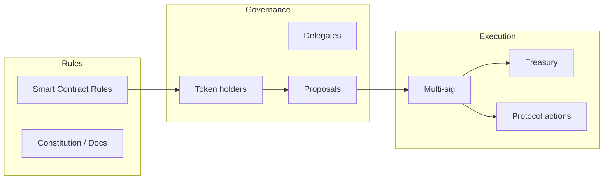

import { Cards } from 'nextra/components'

# DAO — Decentralized Autonomous Organizations

DAOs are internet-native organizations governed by code and collective decision-making. They replace traditional corporate structures with transparent rules, on-chain voting, and community-controlled treasuries.

---

## Topics

<Cards>
  <Cards.Card title="Governance Mechanisms" href="/en/web3/dao/governance" arrow>
    On-chain voting, quadratic voting, and delegation
  </Cards.Card>
  <Cards.Card title="Treasury Management" href="/en/web3/dao/treasury" arrow>
    Multi-sig wallets, spending limits, and asset management
  </Cards.Card>
</Cards>

---

## What makes a DAO?



---

## DAO types

| Type | Examples | Governance |
|------|----------|------------|
| **Protocol DAOs** | Uniswap, Compound, Aave | Token holders govern protocol |
| **Social DAOs** | Friends with Benefits | Token-gated access |
| **Investment DAOs** | BitDAO, The LAO | Pool capital, deploy to projects |
| **Media DAOs** | Bankless, Decrypt | Decentralized content |
| **Grant DAOs** | Gitcoin | Fund public goods |

---

## Governance tokenomics

```solidity
// Simplified governance token
contract GovernanceToken is ERC20 {
    mapping(address => address) public delegates;
    mapping(address => uint256) public checkpointedVotes;
    
    function delegate(address delegatee) external {
        // Move voting power
        _moveDelegation(delegates[msg.sender], delegatee, balanceOf(msg.sender));
        delegates[msg.sender] = delegatee;
    }
    
    function castVote(uint256 proposalId, uint8 support) external {
        // 0 = against, 1 = for, 2 = abstain
        governance.castVote(proposalId, msg.sender, support);
    }
}
```

---

## Token distribution models

| Model | Description | Examples |
|-------|-------------|----------|
| **Fair launch** | No pre-mine, everyone mines/buys | Uniswap |
| **Venture backed** | Early investors get tokens at discount | Compound |
| **Hybrid** | Some team/investor allocation, some public | MakerDAO |

---

## Read next

- [DeFi protocols](/en/web3/defi) — many are governed by DAOs
- [Web3 protocols](/en/web3/protocols) — layer 1 and layer 2 governance