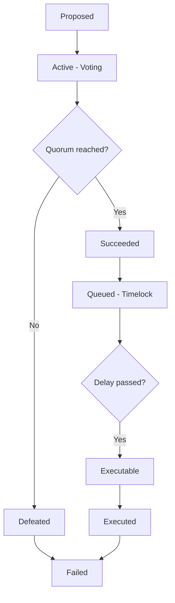

# DAO Governance Mechanisms

Governance mechanisms determine how decisions are made and executed in DAOs. The choice of mechanism significantly impacts participation, fairness, and effectiveness.

---

## Token-weighted voting

The most common model — one token = one vote:

```solidity
contract Governor {
    struct Proposal {
        uint256 id;
        address[] targets;
        uint256[] values;
        bytes[] calldatas;
        uint256 startBlock;
        uint256 endBlock;
        uint256 forVotes;
        uint256 againstVotes;
        bool executed;
        bool canceled;
    }
    
    function castVote(uint256 proposalId, uint8 support) external {
        require(state(proposalId) == ProposalState.Active, "not active");
        require(support <= 2, "invalid vote value");
        
        Proposal storage proposal = proposals[proposalId];
        Receipt storage receipt = receipts[proposalId][msg.sender];
        require(receipt.hasVoted == false, "already voted");
        
        receipt.hasVoted = true;
        receipt.support = support;
        receipt.votes = getVotes(msg.sender, proposal.startBlock);
        
        if (support == 1) {
            proposal.forVotes += receipt.votes;
        } else if (support == 0) {
            proposal.againstVotes += receipt.votes;
        }
    }
}
```

### Problems with token-weighted voting

| Problem | Description | Impact |
|---------|-------------|--------|
| **Whale dominance** | Large holders control outcomes | Centralization |
| **Low participation** | Apathy, voter fatigue | 5% turnout common |
| **Governance attacks** | Buy majority, attack protocol | Security risk |
| ** plutocracy** | Money = power, not expertise | Poor decisions |

---

## Alternative voting mechanisms

### Quadratic voting

Cost to vote increases quadratically — mitigates whale influence:

```
Votes = √(tokens spent)

1 token → 1 vote
100 tokens → 10 votes
10,000 tokens → 100 votes
```

**Implementation:**

```solidity
function quadraticVote(uint256 proposalId, uint256 tokensToSpend) external {
    uint256 votes = sqrt(tokensToSpend);
    require(balanceOf(msg.sender) >= tokensToSpend, "insufficient balance");
    
    _burn(msg.sender, tokensToSpend);
    _castQuadraticVote(proposalId, votes);
}

function sqrt(uint256 x) internal pure returns (uint256) {
    uint256 z = (x + 1) / 2;
    uint256 y = x;
    while (z < y) {
        y = z;
        z = (x / z + z) / 2;
    }
    return y;
}
```

### Conviction voting

Voting weight accumulates over time:

```
Conviction = tokens × time_held
```

Longer-term believers have more influence. Continuous, not discrete.

### Rage quit /Holographic consensus

| Mechanism | Key feature |
|-----------|-------------|
| **Rage quit** | Exit before decision takes effect |
| **Holographic consensus** | Prediction market for proposal importance |

---

## Delegation

Allowing token holders to delegate votes:

```solidity
function delegate(address delegatee) external {
    require(delegatee != address(this), "cannot delegate to contract");
    require(delegatee != msg.sender, "cannot self-delegate");
    
    address currentDelegate = delegates[msg.sender];
    uint256 delegatorBalance = balanceOf(msg.sender);
    
    delegates[msg.sender] = delegatee;
    emit DelegateChanged(msg.sender, currentDelegate, delegatee);
    
    _moveDelegation(currentDelegate, delegatee, delegatorBalance);
}
```

### Delegate responsibilities

| Role | Responsibilities |
|------|------------------|
| **Personal voting** | Research, vote on proposals |
| **Representing** | Communicate community sentiment |
| **Reporting** | Share voting rationale publicly |

---

## Governor Bravo (Compound)

The most forked governance contract:

```solidity
interface IGovernorBravo {
    function propose(
        address[] memory targets,
        uint256[] memory values,
        string[] memory signatures,
        bytes[] memory calldatas,
        string memory description
    ) external returns (uint256);
    
    function castVote(uint256 proposalId, uint8 support) external;
    function castVoteWithReason(uint256 proposalId, uint8 support, string memory reason) external;
    function castVoteBySig(uint256 proposalId, uint8 support, uint8 v, bytes32 r, bytes32 s) external;
    
    function queue(uint256 proposalId) external;
    function execute(uint256 proposalId) external payable;
    function cancel(uint256 proposalId) external;
}
```

### Proposal lifecycle



---

## Time lock (Timelock)

Actions are delayed to allow veto:

```solidity
contract Timelock {
    uint256 public constant GRACE_PERIOD = 14 days;
    uint256 public constant MIN_DELAY = 2 days;
    
    mapping(bytes32 => bool) public queuedTransactions;
    
    function queueTransaction(
        address target,
        uint256 value,
        bytes memory data
    ) public returns (bytes32) {
        require(msg.sender == admin, "not admin");
        uint256 eta = block.timestamp + MIN_DELAY;
        bytes32 txHash = keccak256(abi.encode(target, value, eta, data));
        queuedTransactions[txHash] = true;
        emit QueueTransaction(txHash, target, value, data, eta);
        return txHash;
    }
    
    function executeTransaction(bytes32 txHash) public payable {
        require(queuedTransactions[txHash], "not queued");
        (, uint256 eta,,,) = decodeTransactionParams(txHash);
        require(block.timestamp >= eta + MIN_DELAY, "not ready");
        require(block.timestamp <= eta + GRACE_PERIOD, "expired");
        
        queuedTransactions[txHash] = false;
        (bool success, ) = target.call.value(value)(data);
        require(success, "execution failed");
    }
}
```