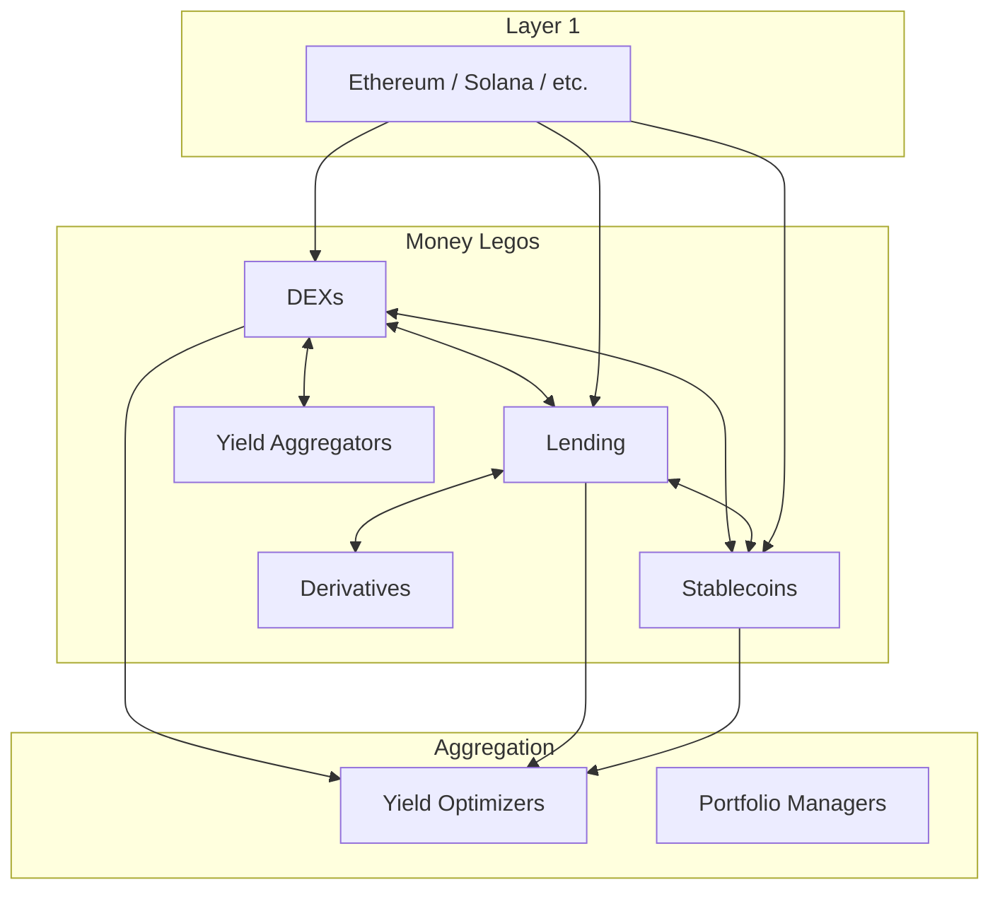

import { Cards } from 'nextra/components'

# DeFi — Decentralized Finance

Decentralized Finance (DeFi) recreates traditional financial instruments — exchanges, lending, stablecoins, derivatives — using smart contracts on public blockchains. Users retain full custody of assets while accessing financial services through composable protocols.

---

## Topics

<Cards>
  <Cards.Card title="Decentralized Exchanges (DEX)" href="/en/web3/defi/dex" arrow>
    AMMs, order books, and liquidity provision
  </Cards.Card>
  <Cards.Card title="Lending & Borrowing" href="/en/web3/defi/lending" arrow>
    Collateralized loans, interest rates, and liquidation
  </Cards.Card>
  <Cards.Card title="Stablecoins" href="/en/web3/defi/stablecoins" arrow>
    Pegged currencies — algorithmic vs collateralized
  </Cards.Card>
  <Cards.Card title="Yield & Derivatives" href="/en/web3/defi/yield" arrow>
    Yield farming, staking, perpetuals, and options
  </Cards.Card>
</Cards>

---

## The DeFi stack

---

## Key metrics

| Metric | Description |
|--------|-------------|
| **TVL** | Total Value Locked — total assets deposited |
| **Volume** | Trading or borrowing volume in period |
| **APY** | Annual Percentage Yield — effective return |
| **Utilization** | % of deposited assets currently lent out |

---

## DeFi vs Traditional Finance

| Aspect | DeFi | Traditional Finance |
|--------|------|-------------------|
| Custody | Self-custody (you own keys) | Third-party custody |
| Access | Anyone with internet | KYC required, geography restricted |
| Hours | 24/7/365 | Business hours only |
| Settlement | Minutes or seconds | Days |
| Intermediaries | None (or minimal) | Banks, brokers, clearinghouses |
| Composability | Permissionless mixing | Siloed systems |
| Regulation | Minimal | Heavy |

---

## Risks

| Risk | Description | Mitigation |
|------|-------------|------------|
| **Smart contract** | Bug exploits, read-only attacks | Audits, bug bounties, insurance |
| **Impermanent loss** | LP position loses value vs holding | Stablecoin pools, hedging |
| **Liquidation** | Collateral drops below threshold | Overcollateralization, monitoring |
| **Regulatory** | Protocol shutdowns, sanctions | Decentralization, jurisdiction |

---

## Read next

- [NFT](/en/web3/nft) — trading digital assets
- [DAO](/en/web3/dao) — protocol governance