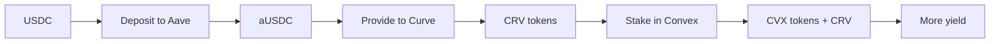

# Yield & Derivatives

Beyond basic lending, DeFi offers complex financial instruments: yield strategies that optimize returns, and derivatives like perpetuals and options that provide leverage and hedging.

---

## Yield Farming

Yield farming involves strategically moving assets across protocols to maximize returns:



**Yield sources:**
1. **Lending interest** — Aave, Compound
2. **Trading fees** — DEX LP rewards
3. **Liquidity mining** — Protocol token incentives
4. **Staking rewards** — Proof of Stake validation

### Yield aggregators

Protocols that automate yield farming:

| Protocol | Strategy |
|----------|---------|
| **Yearn** | Auto-shifts capital to highest yield |
| **Beefy** | Multi-chain auto-compounding |
| **Convex** | Optimizes Curve yields |
| **Pendle** | Separates yield into principal + yield |

---

## Staking derivatives

Staking ETH locks assets for validation. **Liquid staking** derivatives (LSDs) provide liquidity:

| Token | Protocol | Description |
|-------|----------|-------------|
| **stETH** | Lido | 1:1 staking ETH |
| **rETH** | Rocket Pool | Market-rate ETH |
| **frxETH** | Frax | Partial collateral |

**Yield:** ~4-5% APY from validation + MEV tips

### Re-staking

EigenLayer allows restaking ETH to secure additional networks:

```
ETH → Lido stETH → EigenLayer restaked → Earn additional yield
```

---

## Perpetual Futures

Perpetuals are futures contracts without expiration — the closest thing to leveraged trading in DeFi.

### Funding rate mechanism

```solidity
function _updateFundingRate() internal {
    int256 premium = spotPrice - markPrice;
    int256 fundingRate = premium / 8 / 1e18;
    
    // Longs pay shorts (or vice versa)
    if (fundingRate > 0) {
        positions[longs].fundingGrowth += fundingRate;
    } else {
        positions[shorts].fundingGrowth -= fundingRate;
    }
}
```

| Protocol | Chain | Max Leverage |
|----------|-------|-------------|
| **dYdX** | Cosmos | 25x |
| **GMX** | Avalanche | 50x |
| **Perpetual** | Optimism | 10x |
| **Drift** | Solana | 10x |

---

## Options

Options give the right (not obligation) to buy/sell at a set price:

| Type | Right | Premium paid by |
|------|-------|----------------|
| **Call** | Buy at strike | Buyer |
| **Put** | Sell at strike | Buyer |

### DeFi options protocols

| Protocol | Model | Settlement |
|----------|-------|-----------|
| **Hegic** | P2P options | On-chain |
| **Lyra** | AMM for options | ETH |
| **Premia** | P2P with blue chip collection | Multiple |
| **Thales** | Parimutuel model | Synthetix assets |

```solidity
// Simplified covered call
function sellCall(uint strike, uint expiry) external returns (uint premium) {
    // Lock user's assets until expiry
    require(balanceOf(msg.sender) >= 1 ether);
    locked[msg.sender] += 1 ether;
    
    premium = _computePremium(strike, expiry);
    premiumToken.transfer(msg.sender, premium);
    
    // Register obligation to deliver if exercised
    obligations[msg.sender].calls.push(Option(strike, expiry));
}
```

---

## Risk management

### Strategies

| Strategy | Risk | Expected Return |
|----------|------|----------------|
| **Stablecoin LP** | Low | 5-15% |
| **ETH staking** | Medium | 4-8% |
| **Long-term holding** | High | Variable |
| **Leveraged yield** | High | 10-30%+ |
| **Delta-neutral** | Medium | 5-20% |

### Common risks

| Risk | Description |
|------|-------------|
| **Impermanent loss** | LP value diverges from holding |
| **Smart contract** | Protocol exploits |
| **Regulatory** | Protocol shutdowns |
| **Liquidity** | Cannot exit position |
| **MEV** | Front-run, sandwich attacks |