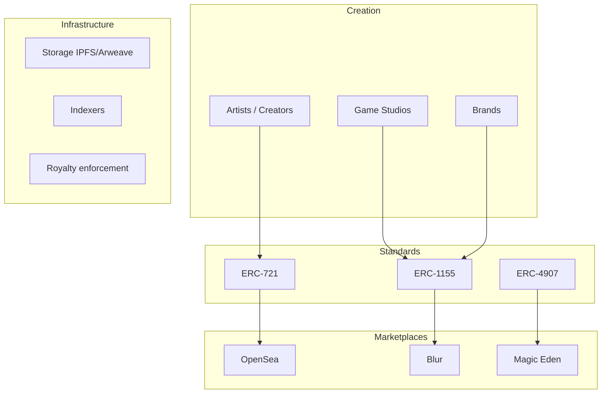

import { Cards } from 'nextra/components'

# NFT — Non-Fungible Tokens

NFTs represent unique digital assets with verifiable ownership on the blockchain. While often associated with digital art and collectibles, the technology extends to gaming items, real-world asset tokenization, identity credentials, and more.

---

## Topics

<Cards>
  <Cards.Card title="Token Standards" href="/en/web3/nft/standards" arrow>
    ERC-721, ERC-1155, and evolving standards
  </Cards.Card>
  <Cards.Card title="Marketplaces" href="/en/web3/nft/marketplaces" arrow>
    OpenSea, Blur, Magic Eden, and the aggregator wars
  </Cards.Card>
  <Cards.Card title="Gaming & Metaverse" href="/en/web3/nft/gaming" arrow>
    GameFi, virtual worlds, and play-to-earn economics
  </Cards.Card>
</Cards>

---

## What makes something "non-fungible"?

| Aspect | Fungible | Non-Fungible |
|--------|----------|--------------|
| **Interchangeability** | 1 ETH = 1 ETH | CryptoKitty #123 ≠ CryptoKitty #456 |
| **Divisibility** | Can be split (0.5 ETH) | Typically indivisible |
| **Identity** | No unique identity | Unique token ID |
| **Use case** | Currency, governance | Art, collectibles, tickets |

---

## NFT ecosystem map

---

## The NFT lifecycle

1. **Create** — Mint via contract or marketplace
2. **List** — Create sell order (fixed or auction)
3. **Discover** — Buyers find via marketplaces, aggregators
4. **Trade** — Atomic swap on exchange
5. **Transfer** — Send to another wallet
6. **Burn** — Destroy (optional)

---

## Beyond JPEG

| Category | Examples | Description |
|----------|----------|-------------|
| **PFP projects** | BAYC, Azuki | Profile pictures with community access |
| **Digital art** | Beeple, Art Blocks | 1/1 generative or curated art |
| **Music** | Catalog, Royal | Ownership and royalties |
| **Gaming items** | Axie, Gods Unchained | In-game assets |
| **Tickets** | NFT ticketing | Event access, secondary royalties |
| **Real-world assets** | RealT, Rally | Property, luxury goods tokenized |
| **Identity/Credentials** | POAP, Sismo | Attendance proof, reputation |

---

## Read next

- [Smart Contract Languages](/en/web3/languages) — how NFTs are implemented
- [DAO governance](/en/web3/dao) — NFT-based governance models