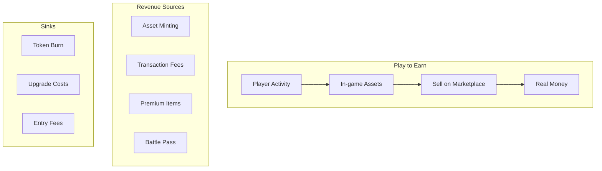

# NFT Gaming & Metaverse

NFTs in gaming enable true ownership of in-game assets, player-driven economies, and new monetization models. However, the "play-to-earn" hype of 2021-2022 gave way to more sustainable models in 2023-2024.

---

## GameFi economics

### Traditional vs NFT gaming

| Aspect | Traditional | NFT Gaming |
|--------|-------------|------------|
| **Ownership** | Developer owns assets | Player owns assets |
| **Transfer** | No | Yes (marketplace) |
| **Secondary revenue** | None | Royalty to developer |
| **Economy** | Closed | Open, player-driven |
| **Cross-game** | Impossible | Possible (standards) |

### Tokenomics fundamentals



---

## Major gaming NFTs

| Game | Platform | Asset type | Peak volume |
|------|----------|------------|-------------|
| **Axie Infinity** | Ronin | Creatures (axies) | $200M/day |
| **STEPN** | Solana | Sneakers | $100M/day |
| **Gods Unchained** | Ethereum | Cards | $10M/day |
| **Illuvium** | Ethereum | Creatures | $5M/day |

---

## Virtual worlds (Metaverse)

Persistent, owned virtual spaces:

| World | Platform | Land type | Price range |
|-------|----------|-----------|-------------|
| **Decentraland** | Ethereum | LAND (16x16m) | $3-20K |
| **The Sandbox** | Ethereum | LAND (16x16m) | $3-30K |
| **Otherside** | Ethereum | Otherdeed | $2-10K |
| **Voxels** | Ethereum | Parcels | $1-50K |

### Virtual world contracts

```solidity
// Simplified LAND contract
contract LAND {
    mapping(int256 => address) public landOwners;
    
    function mintLand(int256 x, int256 y, address to) external {
        int256 landId = (x << 128) + y; // Encode coordinates
        require(landOwners[landId] == address(0), "already owned");
        landOwners[landId] = to;
        _mint(to, landId);
    }
    
    function transferLand(int256 x, int256 y, address to) external {
        int256 landId = (x << 128) + y;
        address owner = landOwners[landId];
        require(owner == msg.sender, "not owner");
        landOwners[landId] = to;
        safeTransferFrom(owner, to, landId);
    }
}
```

---

## Play-to-earn problems

The 2021-2022 P2E boom collapsed due to:

| Problem | Description |
|---------|-------------|
| **Ponzi economics** | New player money paid old players |
| **No organic demand** | Assets valued only for earning |
| **Hyperinflation** | Token supply exceeded demand |
| **Botting** | Automated farming devalued effort |
| **Regulatory** | Securities concerns |

### Evolution: P2E 2.0

More sustainable models emerged:

1. **Battle pass + cosmetics** — No earning, just ownership
2. **Skill-based rewards** — Competitive ranked rewards
3. **Free-to-own** — No entry cost, cosmetic monetization
4. **Hybrid** — Traditional game + NFT marketplace

---

## Guilds and scholarships

NFT gaming enabled new social structures:

| Model | Description |
|-------|-------------|
| **Scholarship** | Guild loans assets to players, splits earnings |
| **Guild Fi** | Protocol for guild management and yield |
| **Rental** | Rent assets without earning sharing |

```solidity
// Simplified rental contract (ERC-4907 based)
contract RentalManager {
    struct Rental {
        address renter;
        uint256 hourlyRate;
        uint256 deposit;
        uint64 expires;
    }
    
    mapping(uint256 => Rental) public rentals;
    
    function rent(uint256 tokenId, uint64 duration) external payable {
        Rental storage rental = rentals[tokenId];
        require(rental.expires < block.timestamp, "already rented");
        
        uint256 cost = rental.hourlyRate * duration;
        require(msg.value >= cost + rental.deposit, "insufficient payment");
        
        rental.renter = msg.sender;
        rental.expires = uint64(block.timestamp + duration * 3600);
        
        // Refund excess payment
        if (msg.value > cost + rental.deposit) {
            payable(msg.sender).transfer(msg.value - cost - rental.deposit);
        }
    }
}
```

---

## Cross-game assets

The dream of portable assets across games:

| Project | Approach |
|---------|----------|
| **X2Y2** | Cross-game marketplace |
| **Immutable** | Protocol for game asset portability |
| **Playko** | Standardized assets across studios |