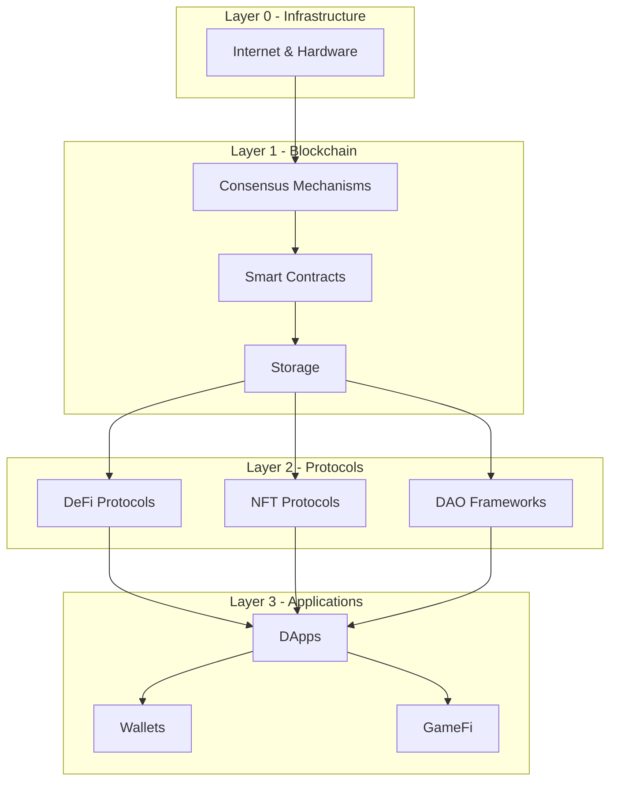

import { Cards } from 'nextra/components'

# Web3 — from blockchain basics to DeFi, NFTs, and DAOs

Web3 represents a paradigm shift in how we think about the internet — from centralized platforms to decentralized, trustless protocols. This section covers the full stack: from cryptographic foundations to decentralized applications (DApps), financial protocols (DeFi), digital collectibles (NFTs), and decentralized governance (DAOs).

**Sidebar structure:** **Level 1** — **Overview**, **Basics**, **Smart Contract Languages**, **DeFi**, **NFT**, **DAO**, **Protocols & Ecosystems**. Each topic has deep dives into specific concepts, protocols, and applications.

---

## How the topics split

| Topic | What belongs here |
|-------|-------------------|
| [Basics](/en/web3/basics) | Blockchain fundamentals, consensus mechanisms, cryptography, wallets |
| [Smart Contract Languages](/en/web3/languages) | Solidity, Rust, Move — writing programs for blockchains |
| [DeFi](/en/web3/defi) | Decentralized exchanges, lending protocols, stablecoins, yield farming |
| [NFT](/en/web3/nft) | Token standards, marketplaces, gaming, digital ownership |
| [DAO](/en/web3/dao) | Governance mechanisms, voting systems, treasury management |
| [Protocols](/en/web3/protocols) | Ethereum, Solana, Layer 2s, cross-chain bridges |

---

## The Web3 stack

---

## Key milestones

| Year | Event | Significance |
|------|-------|--------------|
| **2008** | Bitcoin whitepaper | First practical decentralized currency |
| **2013** | Ethereum whitepaper | Smart contracts enable programmable blockchain |
| **2015** | Ethereum mainnet | First general-purpose smart contract platform |
| **2020** | DeFi summer | Explosive growth of financial protocols |
| **2021** | NFT boom | Digital ownership goes mainstream |
| **2022** | DAO proliferation | Decentralized governance at scale |
| **2023-2025** | Layer 2 scaling | Rollups bring scalability to Ethereum |

---

## How this integrates with other site sections

- **Programming basics**: [Programming language timeline](/en/timeline) — history of languages including Solidity's influence
- **Consensus vs AI**: [AI Timeline](/en/ai-timeline) — parallel track of decentralized vs centralized intelligence
- **Data & storage**: [Datasets](/en/datasets/overview) — on-chain data analysis and blockchain analytics
- **Hardware**: [Hardware](/en/hardware/overview) — nodes, miners, and physical infrastructure

---

## Extended reading

Chinese full narrative: [ /zh/web3/overview ](/zh/web3/overview).

---

## Maintainer Reference

This module follows the [Web3 Content Maintenance Conventions](/en/spec/nextra-sidebar-lessons), covering MDX file specs, mixed-language rules, zh/en sync rhythm, link style, Hub page template, and build verification.