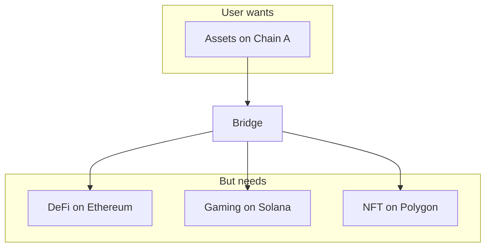

# Cross-chain Infrastructure

As multiple blockchains gain adoption, the need to move assets and data between chains becomes critical. Cross-chain infrastructure enables the connected Web3 ecosystem.

---

## Why cross-chain matters



| Reason | Description |
|--------|-------------|
| **Fragmented liquidity** | Capital locked on single chains |
| **Different use cases** | Each chain specializes |
| **User experience** | Users hold assets on multiple chains |
| **Arbitrage** | Price differences between chains |

---

## Bridge types

### Lock and mint

1. Lock assets on source chain
2. Mint wrapped asset on destination

```
Chain A: Lock 1 ETH → Mint 1 WETH on Chain B
```

### Burn and mint

1. Burn asset on source chain
2. Mint equivalent on destination

```
Chain A: Burn 1 SOL → Chain B: Mint 1 SOL
```

### Liquidity networks

Pool-based, like AMMs for cross-chain:

```solidity
interface ICrossChainSwap {
    function swap(
        address fromToken,
        uint256 amountIn,
        uint256 minAmountOut,
        uint16 destChain,
        address recipient
    ) external payable;
}
```

---

## Major bridge protocols

| Protocol | Type | Volume (2024) | Notable |
|----------|------|---------------|---------|
| **Stargate** | Liquidity | ~$10B | Delta algorithm |
| **LayerZero** | Messaging | N/A | Omnichain |
| **Wormhole** | Messaging | ~$20B | Guardian network |
| **Axelar** | Messaging | N/A | PoS +拜占庭 |
| **Celer** | Liquidity | ~$5B | Multi-chain |

---

## Cross-chain messaging

### LayerZero architecture

```solidity
// LayerZero endpoint
interface ILayerZeroEndpoint {
    function send(
        uint16 _dstChainId,
        bytes calldata _destination,
        bytes calldata _payload,
        address payable _refundAddress,
        address _zroPaymentAddress,
        bytes calldata _adapterParams
    ) external payable;
}
```

### Application-level execution

```solidity
// Example: Cross-chain swap receiver
contract SwapReceiver {
    function lzReceive(
        uint16 srcChainId,
        bytes calldata srcAddress,
        uint64 nonce,
        bytes calldata payload
    ) external override {
        (address token, uint256 amount, address recipient) = abi.decode(payload);
        // Execute swap on destination chain
        IERC20(token).transfer(recipient, amount);
    }
}
```

---

## Security considerations

### Bridge vulnerabilities

| Incident | Amount lost | Cause |
|----------|-------------|-------|
| **Ronin** | $625M | Validator compromise |
| **Wormhole** | $320M | Signature verification |
| **Nomad** | $190M | Initialization bug |
| **Harmony** | $100M | Multisig hack |

### Trust models

| Model | Security | Decentralization |
|-------|----------|------------------|
| **Multisig** | Low-Medium | Centralized |
| **Light client** | High | Decentralized |
| **ZK proof** | Highest | Decentralized |
| **Liquidity** | Medium | Varies |

---

## The multi-chain future

| Vision | Description |
|--------|-------------|
| **Chain abstraction** | Users don't know/care which chain |
| **Unified liquidity** | Single pool across chains |
| ** intent-based** | User says intent, solvers execute cross-chain |
| **Account abstraction** | Smart wallets handle chain complexity |