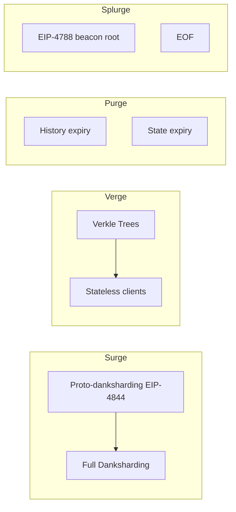

# Ethereum

Ethereum is the foundational platform for smart contracts, DeFi, and NFTs. Created by Vitalik Buterin in 2013, it pioneered programmable blockchain and remains the most valuable (after Bitcoin) and most actively developed blockchain ecosystem.

---

## Evolution

### The journey

| Year | Milestone | Significance |
|------|-----------|--------------|
| **2015** | Mainnet launch | First general smart contract platform |
| **2017** | CryptoKitties | First major congestion event |
| **2019** | Constantinople | Gas optimization hard fork |
| **2020** | EIP-1559 | Fee burning, base fee mechanism |
| **2022** | The Merge | PoS transition, 99.95% energy reduction |
| **2023** | EIP-4844 (proto-danksharding) | Cheaper L2 data blobs |
| **2024+** | Full danksharding | Full data availability sampling |

### Block reward evolution

```solidity
// PoW era (2015-2022)
constant BLOCK_REWARD = 5 ether // 5 ETH per block

// PoS era (2022+)
BLOCK_REWARD = 2^18 * S — varies with participation rate
// Approximately 1600 ETH/day vs ~13500 ETH/day PoW
```

---

## Account model

Ethereum has two account types:

```solidity
// Externally Owned Account (EOA)
struct EOA {
    uint256 nonce;      // Transaction count
    uint256 balance;     // ETH balance
    bytes32 codeHash;    // Empty for EOA
    bytes32 storageRoot; // Empty for EOA
}

// Contract Account (CA)
struct Contract {
    uint256 nonce;       // Creation count + tx count
    uint256 balance;     // ETH balance
    bytes32 codeHash;    // Contract bytecode hash
    bytes32 storageRoot; // Merkle root of storage
}
```

**Key difference:** CAs have code, EOAs have private keys.

---

## Gas and fees (EIP-1559)

```solidity
// Fee calculation
BaseFee = BlockBaseFee * GasLimit / ElasticityMultiplier

// Priority fee (tip to miner/validator)
PriorityFee = min(transaction.maxPriorityFee, transaction.maxFee - BlockBaseFee)

// Effective gas price
EffectiveGasPrice = min(transaction.maxFee, BlockBaseFee + PriorityFee)

// Total fee
TotalFee = GasUsed * EffectiveGasPrice

// Burn (EIP-1559)
if (block.gasLimit > parent.gasLimit * TARGET) {
    BaseFee = BaseFee * (1000000 + (block.gasLimit - parent.gasLimit) * 6) / (parent.gasLimit * 6)
}
```

---

## The Merge architecture

Post-merge Ethereum has two clients:

| Component | Former | Current |
|-----------|--------|---------|
| **Consensus** | PoW miners | PoS validators |
| **Execution** | ETH1 nodes | EL clients |
| **Block production** | Mining | Proposing |

### Beacon Chain

The PoS consensus layer:

```solidity
// Beacon Chain deposit
struct Validator {
    bytes pubkey;
    bytes withdrawal_credentials;
    bytes effective_balance;
    uint64 slashed;
    uint64 activation_eligibility_epoch;
    uint64 activation_epoch;
    uint64 exit_epoch;
    uint64 withdrawable_epoch;
}
```

---

## Ethereum's roadmap



---

## Key protocols on Ethereum

| Category | Examples |
|----------|----------|
| **DeFi** | Uniswap, Aave, Maker, Compound |
| **NFT** | OpenSea, Blur, LooksRare |
| **L2** | Arbitrum, Optimism, Base, ZKsync |
| **DAO** | Nouns, Bitscapes, Compound |

---

## Development ecosystem

| Tool | Purpose |
|------|---------|
| **Hardhat** | Development environment |
| **Foundry** | Fast testing, Forge |
| **OpenZeppelin** | Smart contract library |
| **Alchemy / Infura** | RPC providers |
| **Ethers.js / viem** | JavaScript libraries |
| **Remix** | Web IDE |