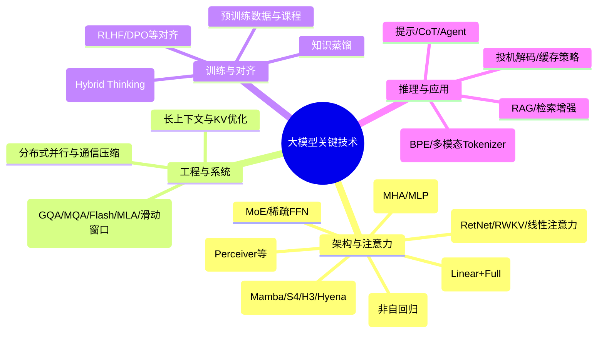

# 架构全景：超越 Transformer 与 MoE

本节盘点**除经典稠密 Transformer 主栈与 MoE 稀疏 FFN 之外**仍值得跟踪的技术族：长序列算子、注意力变体、非自回归语言建摸、多模态统一瓶颈层，以及「不改骨架却决定能不能用」的工程层。

## 思维导图（路线总览）

---

## 1. 状态空间模型 / 线性 RNN 路线（Mamba、S4、H3、Hyena）

- **思想**：用连续/离散状态转移、长卷积或层次卷积，把全局依赖建模从 **O(N²)** 类注意力转向 **O(N)** 或更轻推理步。  
- **训练**：常可并行（如卷积形式）；**推理**可退化为固定状态递推，适合流式与极长序列。  
- **落地姿势**：许多系统选择 **部分层替换为 SSM/线性块**，而非全书改写为单一架构。  
- **取舍**：生态与「精确槽位检索」类任务上，经验上仍常需 **少量全注意力层** 或外部检索补齐。

## 2. 新注意力变体：RetNet、RWKV、线性注意力

- **RetNet**：并提出可在并行训练形式与类 RNN 推理形式之间切换的 Retention 类机制。  
- **RWKV**：将线性注意力的直觉写成 **可加权递推**，训练并行、推理步较轻。  
- **线性注意力**：通过核分离或重排近似 softmax 注意力，复杂度更易随序列线性扩展；实务中多与全注意力混用。

## 3. 混合架构（Linear + Full）

- **动机**：线性块承担 **长程与成本**，全注意力层承担 **细粒度对齐与指代消解**。  
- **工程现象**：大厂与大模型产品中已出现 **固定周期**（例如每 4 层 1 层全注意力）或不同 **线性:全注意力** 配比的公开描述；具体比例依赖数据与评测。

## 4. Diffusion 语言模型（DLM）

- **思想**：将「加噪—去噪」范式用于离散 token 序列，倾向 **非自回归、可并行多步** 生成。  
- **现状**：研究活跃，工业主栈仍以自回归 LM 为主；在双向补全、特定生成形态上值得单独跟踪。

## 5. 多模态统一架构（Perceiver IO 等）

- **思想**：各类输入先打成 **统一 token 流** 或 **瓶颈潜在单元（latents）**，再用共享 Transformer/块处理，输出再解码到任意模态。  
- **相关**：VQ-VAE / VQGAN 等将图像离散化后塞进 LM；**统一 Tokenizer** 尝试收缩视觉-语言词表边界。

## 6. 高效注意力「工程层」

| 方向 | 代表思路 | 作用 |
| :--- | :--- | :--- |
| **MQA / GQA** | 共享或分组 K/V | 压 KV cache |
| **MLA** 等 | 低维潜在 K/V 再展开 | 推理显存与 KV 体积 |
| **FlashAttention** | 分块、减少 HBM↔SRAM | 速度与显存 |
| **滑动/稀疏** | 局部窗 + 少量全局 token | 长文档近似线性 |

## 7. 非架构：系统级技术同样决定上限

- **RAG**：权限、实时性、多跳、长程记忆分层。  
- **对齐**：RLHF、DPO、过程监督等。  
- **蒸馏 / 量化 / 剪枝**：边端与成本。  
- **混合思考**：同一模型在「直答」与「长 CoT」间切换或路由。  
- **分词与多模态 Token 化**：BPE、SentencePiece、视觉离散步长等 —— 往往是跨模态 bug 的根源。

## 8. 小结：如何定位这些路线

- **第一梯队（工业主栈）**：Transformer +（可选）MoE + Flash/GQA/MLA 等工程组合。  
- **第二梯队（高增速）**：**混合线性+全注意力**、**SSM/Mamba 插层**、强多模态统一、世界模型/具身数据闭环。  
- **配套**：RAG、对齐、长上下文记忆架构、Tokenizer 与推理调度 —— 决定「能不能在真实业务里跑稳」。

若你更关注 **底层实现**（如 Router、专家负载、线性注意力内核）还是 **智能体与工具链**，可结合 [2026 技术栈清单](/zh/agi/stack) 做学习与项目切片。
