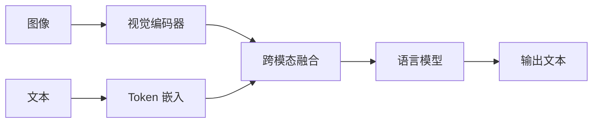

# VLM 视觉语言模型

VLM 将视觉编码器与语言模型结合，实现多模态理解。

---

## 架构类型



---

## 两种常见方法

### 1. 交叉注意力（Flamingo 风格）

```python
class FlamingoBlock(nn.Module):
    def __init__(self, lm_dim, vision_dim, num_heads=8):
        super().__init__()
        self.cross_attn = CrossAttention(
            query_dim=lm_dim,
            key_dim=vision_dim,
            num_heads=num_heads
        )

    def forward(self, x, image_emb):
        # x: 文本隐藏状态
        # image_emb: 来自视觉编码器
        return self.cross_attn(x, image_emb)
```

### 2. 直接投影（LLaVA 风格）

```python
class LLaVA(nn.Module):
    def __init__(self, vision_encoder, lm):
        super().__init__()
        self.vision_encoder = vision_encoder
        self.projector = nn.Linear(vision_dim, lm_dim)

    def forward(self, image, text):
        image_emb = self.vision_encoder(image)
        image_emb = self.projector(image_emb)

        # 与文本嵌入拼接
        text_emb = self.lm.get_input_embeddings()(text)
        combined = torch.cat([image_emb, text_emb], dim=1)

        return self.lm(inputs_embeds=combined)
```

---

## 训练阶段

| 阶段 | 内容 | 数据 |
|------|------|------|
| **预训练** | 仅投影器 | 图文对 |
| **微调** | 全部模型 | 指令数据 |

---

## 主流模型

| 模型 | 视觉编码器 | LLM | 备注 |
|------|------------|-----|------|
| **LLaVA** | CLIP | Vicuna | 开源 |
| **InstructBLIP** | 多种 | Vicuna | 指令微调 |
| **GPT-4V** | 专有 | GPT-4 | 最佳质量 |
| **Gemini** | 专有 | Gemini | Google |
| **Qwen-VL** | Qwen | Qwen | 阿里 |
