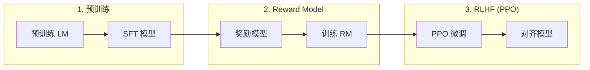

# RLHF

人类反馈强化学习对齐人类偏好。

---

## 三阶段流程



---

## Reward Model

```python
class RewardModel(nn.Module):
    def __init__(self, base_model):
        super().__init__()
        self.base = base_model
        self.reward_head = nn.Linear(hidden_size, 1)
    
    def forward(self, input_ids, attention_mask):
        outputs = self.base(input_ids, attention_mask=attention_mask)
        # 使用最后一个 token 的输出预测奖励
        reward = self.reward_head(outputs.last_hidden_state[:, -1, :])
        return reward
```

---

## 奖励信号

```python
# 对比 loss
def reward_loss(chosen_reward, rejected_reward):
    return -torch.log(torch.sigmoid(chosen_reward - rejected_reward)).mean()
```

---

## PPO 优化

```python
def rlhf_loss(model, old_log_probs, rewards, queries, responses):
    # 计算新策略的 log_probs
    logits = model(queries + responses)
    
    # PPO 比率
    ratio = torch.exp(log_probs - old_log_probs)
    
    # 剪切
    clipped = torch.clamp(ratio, 1-eps, 1+eps)
    
    # KL 惩罚
    kl_penalty = kl_divergence(new_policy, old_policy)
    
    return -min(ratio * rewards, clipped * rewards) + kl_penalty
```

---

## 挑战

| 问题 | 解决方案 |
|------|----------|
| Reward hacking | Reward model 集成 |
| 训练不稳定 | PPO 剪切 |
| 人类偏好成本 | 合成偏好 |
