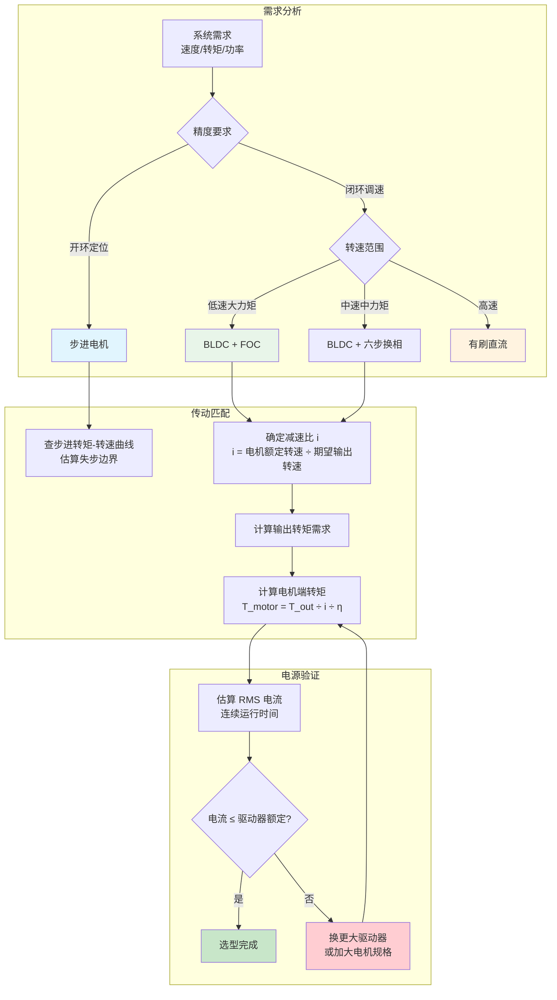

# 执行器与动力

## 常见执行器

- **有刷直流**：简单、碳刷寿命与 EMI。  
- **三相无刷（BLDC）**：需电子换相（FOC/六步）；无人机、车轮、关节常见。  
- **步进**：开环定位、失步与发热。  
- **舵机**：角度闭环，舵机齿轮隙与扭矩曲线。  

## 传动系统

减速比、惯量匹配、背隙对控制带宽的影响；**扭矩-转速-电流**三角关系。

## 电源匹配

峰值电流、持续电流、线规与接头；**低压大电流**下的压降与 brown-out。

## 电机选型流程

以下流程图展示从系统需求到电机规格的完整推导路径：

> **实务 tip**：上述流程针对典型移动机器人底盘场景。工业机械臂通常优先选 FOC 关节模组（集成电机+编码器+驱动），选型流程简化为「扭矩需求 → 模组扭矩规格」直接查表。

## FOC 与选型计算

### 场向量控制（FOC）

FOC（Field-Oriented Control，场向量控制）是 BLDC 和 PMSM 的主流控制策略，核心思路是将三相定子电流投影到旋转坐标系（d/q 轴），分别控制**励磁分量**（d 轴）与**转矩分量**（q 轴），使转矩与电流呈线性关系。相比六步换相，FOC 在零速时也能输出满转矩、低速区段运行更平顺、电机效率更高。

典型 FOC 实现需要：
- **电流采样**：三相或两相采样，配合 Clarke/Park 变换；
- **SVPWM**：空间向量调制，生成马鞍波电压；
- **转子位置反馈**：霍尔传感器、增量编码器或磁编码器。

在机器人关节和无人机 ESC 中，FOC 是标准配置；选型时注意驱动板是否标注"FOC ready"或提供对应 MCU（STM32 G4/C0 系列常见）。

### 选型计算示例

以 4 轮差速底盘为例，走廊铺设地毯，直线速度需求 1 m/s，估算单轮电机规格：

1. **确定单轮负载**：底盘总重 10 kg，左右两侧各承担一半；考虑滚动阻力系数 0.03（地毯）和坡度 5°，单轮等效负载约 2.2 kg（重力分量 0.19 kg）。按 0.1 m 轮半径，所需驱动转矩约 0.22 N·m。

2. **选减速比**：期望输出转速 n_out = 1 m/s ÷ (2π × 0.1 m) ≈ 95 RPM。普通 BLDC 额定转速约 3000–5000 RPM，所需减速比 i ≈ 3000 ÷ 95 ≈ 31.5，取 30:1 或 31:1 行星减速箱。

3. **反算电机端规格**：所需电机转矩 T_motor = T_out ÷ (i × η)。若 η ≈ 0.8，则 T_motor ≈ 0.22 ÷ (30 × 0.8) ≈ 9.2 mN·m。查有刷 DC 或 BLDC 规格，额定转矩 > 10 mN·m 的电机均可满足。

4. **验证 RMS 电流与热容**：若连续运行 30 分钟，平均电流约 3–5 A，选用 10 A 以上的驱动（ESC）并保证散热。

> **实务 tip**：购买前在 Excel 中列出「输出转速 / 减速比 / 电机转速 / 额定转矩 / 峰值转矩 / 持续电流」六列，筛选出同时满足转速和转矩的候选型号，避免只看峰值参数而忽略热衰减。

[基础层导读](/zh/hardware/basics) · [传感器](/zh/hardware/basics/sensing)
