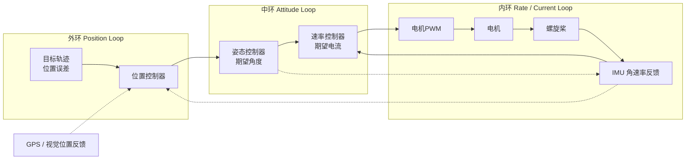

# 控制与估计

控制是连接感知与执行的桥梁。调参良好的控制器接收目标值（设定点或轨迹）和实测输出，计算执行器指令，将误差驱动为零或维持在很小的范围内——这正是区分「晃动振荡」与「平稳跟踪」机器的关键。

## 经典控制入门

**PID** 是嵌入式控制的主力算法，输出由三项构成：

- **P（比例）**：输出与当前误差成正比。增大 P 可减少上升时间，但设得太高会导致超调和振荡。
- **I（积分）**：输出与误差随时间的积分成正比。它消除稳态误差（P 无法解决的持续偏移），但执行器饱和时会导致积分饱和（wind-up）。
- **D（微分）**：输出与误差变化率成正比。它抑制振荡、提高稳定性，但会放大传感器噪声，因此对 D 项做低通滤波是标准做法。

### 调参顺序

实用调参步骤：

1. 将 I 和 D 置零，逐步增大 P，直至系统出现明显振荡或超调。
2. 增大 D 以抑制振荡。D 在二阶及以上系统动力学中效果最佳。
3. 最后加入 I，只需足够消除稳态偏移即可，保持 I 值较小以避免积分饱和。

**抗积分饱和**（Anti-wind-up）：当执行器饱和（如电机达到最大 PWM）时，积分项仍在累积，导致误差最终反转时出现大超调。常见应对方法：将积分项钳位在固定范围、根据执行器余量回算积分项、或在执行器饱和时关闭积分。

### 前馈

**前馈**基于已知扰动或已知目标轨迹，在误差产生之前施加控制动作。最简单的例子：已知机械臂承载的负载质量，可在臂下垂之前预先补偿电机转矩的重力项，而不必等待 PID 来纠正。

前馈减轻了反馈环路的负担——PID 只需处理未建模动力学、测量噪声和意外扰动。在实践中，大多数高性能控制器都是混合形式：`u = Kp·e + Ki·∫e + Kd·de/dt + u_ff`。

## 滤波

原始传感器数据通常含噪声。滑动平均可平滑噪声，但会引入延迟。**一阶低通滤波器**（`y[n] = α·x[n] + (1-α)·y[n-1]`，0 < α < 1）是最常见的替代方案，每采样一次只需一次减法和一次乘法。

### 相位滞后与带宽

所有滤波器都会引入**相位滞后**——输出信号相对于输入在角度上滞后，且滞后随频率增长。相位滞后会降低闭环控制器的有效阻尼。在频域中，控制器**带宽**（bandwidth）是闭环增益降至 1/√2（−3 dB）的频率。带宽越高响应越快，但对传感器噪声越敏感，甚至可能引发不稳定。

实用规则：控制环路带宽应不超过传感器更新率的 1/5 至 1/10。例如 IMU 运行在 1 kHz 而电机控制环路运行在 10 kHz 时有足够余量；但若 IMU 只有 100 Hz 而控制环路需要 500 Hz 带宽，就会出问题。

## 状态估计

传感器很少能直接给出你想要的状态。**估计器**将多个带噪声的测量值融合为一个一致的状态估计。

### 姿态估计问题

静止时，加速度计测量重力，可以从中提取倾斜角。但当载体加速（无人机爬升、汽车制动）时，加速度计同时感知重力与惯性力，倾斜角变得模糊。陀螺仪对角速率积分来跟踪角度，但任何陀螺仪偏置都会导致角度估计无界漂移。

### 互补滤波器

**互补滤波器**融合两个来源：短期用陀螺仪跟踪角度（低噪声、无漂移的优势），长期用加速度计修正倾斜（绝对参考防止漂移）。典型形式：`angle = α·(angle + gyro_rate·dt) + (1-α)·atan2(accel_x, accel_z)`，其中 α 接近 1（如 0.98）。陀螺仪主导高频；加速度计在低频修正漂移。

### 扩展卡尔曼滤波器（EKF）

**扩展卡尔曼滤波器**将卡尔曼滤波推广到非线性系统。它维护一个状态估计和协方差矩阵，用运动模型预测状态前向传播，再用传感器测量值修正预测。EKF 是大多数无人机和汽车系统的标准估计器。

在无人机的 EKF 中，状态向量通常包含位置、速度、姿态（四元数）和 IMU 偏置。EKF 以较高频率使用 IMU 惯性读数运行（预测步），以较低频率使用 GPS、气压计和磁力计运行（修正步）。

### 卡尔曼滤波直观理解

卡尔曼滤波器的核心是两条高斯分布的乘积：预测步的状态分布（先验）乘以测量更新后的状态分布（后验），结果仍是高斯分布。每一步迭代中，**预测**用系统模型传播状态和不确定性（协方差），**更新**用测量残差和卡尔曼增益调整估计。卡尔曼增益 K 决定了我们信任预测还是测量——过程噪声 Q 大时 K 增大（更信测量），测量噪声 R 大时 K 减小（更信预测）。

调参的关键参数是 **Q（过程噪声协方差）**和 **R（测量噪声协方差）**。Q 决定了模型不确定性——Q 太大估计会跳变、Q 太小估计会滞后。R 反映传感器质量——R 越大越保守、越信任模型预测。在实践中，可以先固定 R，用观测数据离线调试 Q，逐步增大 Q 直到估计开始响应真实变化而非噪声。

实用技巧：从单参数调起——把状态增广为「原始状态 + 偏置」，只调偏置的过程噪声，其他状态用很小的 Q，逐步迭代直到收敛。

## 整机差异

- **无人机**：姿态环通常比位置环快一个量级，采用**嵌套环结构**：

无人机嵌套环频率参考：内环速率环 **1–8 kHz** → 中环姿态环 **100–500 Hz** → 外环位置环 **10–100 Hz**。外环比内环慢约一个量级，确保内环在外环反应之前就能抑制快速扰动（阵风、电机不平衡）。
- **车辆**：纵向（速度/牵引力）与横向（转向）控制分开。纵向控制器通过油门和制动命令管理发动机扭矩或制动力；横向控制器跟踪期望转向角以沿路径行驶，但必须尊重轮胎力极限（**摩擦圆**——轮胎产生的侧向力不能超过其承载能力）。车辆动力学在极限情况下（轮胎打滑）高度非线性，这也是高级系统使用模型预测控制（MPC）而非简单 PID 的原因。
- **机械臂**：在**关节空间**（每个电机的角度）或**笛卡尔空间**（末端执行器的位置和姿态）中运行。典型臂控制器有外层笛卡尔轨迹环、将笛卡尔误差转换为关节误差的逆运动学阶段，以及在内侧电机驱动器上运行的关节转矩/位置内环。机械臂还面临**奇异性**问题——当雅可比矩阵降秩时，小的笛卡尔运动需要巨大的关节运动，朴素控制可能请求不可能的速度。处理奇异性是机械臂控制的核心部分。

## 实践建议：从 PID 和滤波器开始

1. **第一个项目**：实现电机速度控制的 PID（带编码器反馈的直流电机）。先只用 P，增加直到它振荡，然后加 D 来阻尼。最后加 I，只需足够消除稳态速度误差。
2. **滤波**：一阶低通滤波器 α = 0.1–0.2 是大多数传感器信号的不错起点。对于 IMU 数据，互补滤波器 α ≈ 0.98 足以对慢速平台的姿态估计。只有在需要融合超过两个传感器源或需要精确协方差跟踪时才使用 EKF。
3. **前馈**：当已知主要扰动时加入。平衡机器人的重力补偿、快速移动臂的惯性补偿——这些是最明显的收益场景。

[基础层导读](/zh/hardware/basics) · [通信](/zh/hardware/basics/communication)
