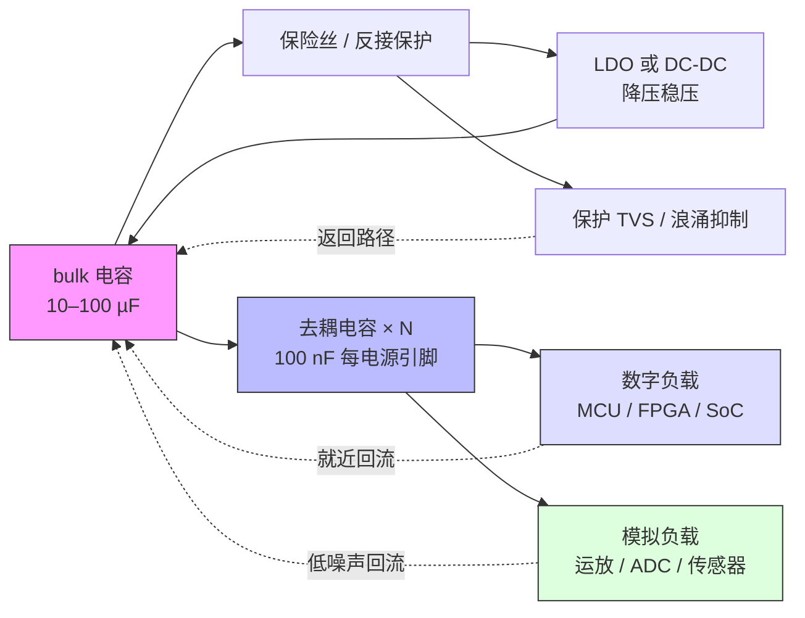

# 电路与电子

## 你要建立的最小概念集

- **电压 / 电流 / 功率**：欧姆定律、额定值与**热**（散热、线径、连接器载流）。  
- **模拟 vs 数字**：运放周边、ADC 采样、噪声与地线回流。  
- **直流配电**：电池化学（锂聚合物/圆柱）、BMS 粗识、保险丝与反接保护。  
- **数字电平**：3.3V / 5V 容忍、逻辑门限、开漏与上拉。

下表列出常见逻辑电平的关键参数对比，帮助在实际设计中快速判断兼容性：

| 逻辑家族 | V_DD (典型) | V_IL (max) | V_IH (min) | V_OL (max) | V_OH (min) | 5V 容忍 | 典型应用 |
|----------|------------|------------|------------|------------|------------|---------|---------|
| CMOS 3.3V (LVCMOS) | 3.3 V | 0.8 V | 2.0 V | 0.1 V | 2.9 V | 否 | FPGA、MCU I/O |
| CMOS 5V (HC/HCT) | 5 V | 1.5 V | 3.5 V | 0.1 V | 4.9 V | 是 | 通用逻辑、74 系列 |
| LVTTL 3.3V | 3.3 V | 0.8 V | 2.0 V | 0.4 V | 2.0 V | 否 | 早期 FPGA、存储 |
| LVDS | 3.3 V | — | — | 1.05 V (共模 1.2 V) | — | 否 | 高速板内差分、SerDes |
| 开漏 / 上拉输出 | 由上拉电压定 | 由接收端决定 | 由上拉电压决定 | 0.4 V (max) | 高阻 → 靠上拉 | 可选 | I2C、总线、唤醒线 |

**电平转换**时需要特别注意：单向降压（如 5V→3.3V）可用限流电阻或电平转换 IC；升压（如 3.3V→5V）需要专用升压 IC 或开漏外加上拉。直接连接不兼容电平的器件（如 5V CMOS 输出直连 3.3V LVTTL 输入）可能损坏 3.3V 器件的输入保护二极管。  

## 和后面整机的关系

- **无人机**：大电流瞬态（电调）、电源纹波影响 IMU。  
- **汽车**：12V/48V 网络、浪涌与 EMC 入门。  
- **机器人**：多路电机驱动与主控**共地**、隔离场合（工业）。  

## 地线与电源完整性

硬件系统的信号质量高度依赖地线和电源分配的设计。**地线回路**是调试中常见的麻烦——当两个电路参考不同位置的地电位时，大电流回流路径上的微小电阻差异就会在两点之间产生毫伏级的电位差，这个偏移会叠加到传感器信号上，导致测量结果漂移或出现莫名其妙的振荡。CAN、RS-485 等差分接口通过两根信号线的电压差来传输数据，能够天然抑制共模噪声——这就是为什么汽车和工业现场广泛使用差分总线的原因。

下图展示典型的电源分配架构，从输入电源经过各级滤波和去耦，最终达到负载：

**配电设计三要点**：① **就近去耦**——每个芯片的 VCC 引脚旁放置 100 nF 去耦电容，引线不超过 3 mm；② **分层滤波**——bulk 电容吸收大电流瞬变（如电机启动），去耦电容抑制高频开关噪声；③ **单点星接地**——数字地和模拟地仅在电源入口单点汇合，避免数字开关噪声经共享地阻抗耦合进模拟信号路径。

完整的地平面（Ground Plane）在 PCB 设计中极为重要。连续的地平面提供低阻抗的回流路径，让高频电流就近汇入地，避免走线形成环路天线辐射干扰。分割地平面（如数字地与模拟地分开）要格外谨慎——只有在单点汇合、且低频模拟电路不受数字开关噪声影响的前提下才有效，跨分割区的高速信号走线会把噪声耦合进模拟区域。

电源完整性同样关键。数字芯片的每个电源引脚附近应放置 **100 nF 去耦电容**（尽可能靠近引脚），抑制芯片开关时在电源轨上产生的高频瞬态电压。对于电机驱动等大电流负载，大容量电解电容（10–100 µF）安装在电源入口处，用于在负载突变时提供瞬态电流储备——没有足够的 bulk 电容，电机加速时的电流尖峰会拉低电源电压，造成系统异常复位。

## 测量实践：万用表与示波器

- **万用表测电压**：先确认电源轨在空载和带载下的实际值。LDO 输入输出之间的压差是否足够？带载后电源电压是否跌落超出芯片规格？这些是排查电源问题最基本的第一步。
- **示波器看波形**：电源纹波有多大？开关频率是多少？PWM 驱动电机时的上升沿是否干净？示波器带宽至少要能覆盖开关频率的 5–10 倍才能准确观察波形细节。
- **电流测量**：用万用表的电流档串联到电源回路，或用电流探头夹住走线测量峰值电流。电机堵转时的堵转电流往往是持续额定电流的 3–7 倍，是选择保险丝和线缆规格的关键依据。

## 实践建议

先在一块洞洞板或成品模块上：**测电压、看波形、算功耗**，再进自制 PCB。  

[基础层导读](/zh/hardware/basics) · [下一章：嵌入式](/zh/hardware/basics/embedded)
