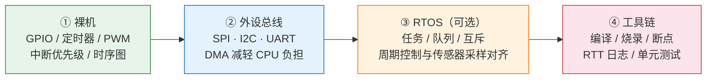

# 嵌入式与 MCU

## 能力阶梯

以下四层构成嵌入式开发的递进路径，每层建立在前一层的基础上：

| 层级 | 核心技能 | 标志性成果 |
|------|----------|------------|
| ① 裸机 | GPIO / 定时器 / PWM / 中断 / 时序图 | 点亮 LED、读取按键、用输入捕获测脉宽 |
| ② 外设总线 | SPI / I2C / UART / DMA | 驱动 IMU 读取、扩展传感器总线 |
| ③ RTOS | 任务调度 / 队列通信 / 互斥 | 多传感器融合、周期性控制回路 |
| ④ 工具链 | 调试器 / RTT 日志 / 单元测试 | 可维护、可诊断、可回归的固件 |  

## 中断 / DMA / 调试

### 中断

中断是 MCU 响应外设事件的核心机制。当 GPIO 引脚检测到下降沿、UART 接收到一字节数据、或定时器溢出时，CPU 被打断，转去执行中断向量表中对应的处理函数（ISR，Interrupt Service Routine）。

**向量表与优先级**：每个中断源在向量表中占有一席之地，地址固定（部分 ARM 芯片支持向量表重映射）。NVIC（Nested Vectored Interrupt Controller）管理优先级，数值越小优先级越高。高优先级中断可以打断低优先级 ISR，形成嵌套。常见坑：低优先级 ISR 中做了耗时操作（如打印调试信息），导致更高优先级中断被延迟，引发时序错误。

**使能与清除**：外设的中断使能位（如 USART 的 RXNEIE）必须开启，NVIC 中对应通道也要使能。处理完毕后，必须清除外设挂起标志（如 UART 的 RXNE），否则会反复进入同一 ISR。某些外设（EXTI）在清除时还需要读写对应寄存器才能真正清除。

### DMA

DMA（Direct Memory Access）让外设与内存之间直接搬运数据，无需 CPU 介入。在传感器高速采样（如 ADC 多通道）或 UART/SPI 大批量收发时，DMA 可显著降低 CPU 负担，避免轮询或频繁中断带来的时序抖动。

**传输模式**：常用模式包括「内存到外设」（如 UART 发送缓冲区）和「外设到内存」（如 ADC 结果缓冲区）。循环模式（Circular mode）适合 ADC 连续采样，双缓冲（Double buffer）适合实时流式传输。配置时需注意数据宽度对齐（字节/半字/字），否则可能产生总线错误。

**何时用 DMA**：数据速率超过 10 kHz、或单次传输超过 8 字节时，DMA 通常比中断更合适。但 DMA 通道有限，且共享同一总线矩阵（bus matrix），高并发 DMA 可能引发总线仲裁延迟，需结合具体芯片数据手册评估。

### 调试

**硬件调试接口**：ARM Cortex-M 系列普遍支持 SWD（Serial Wire Debug），只需两根线（SWCLK/SWDIO）即可实现断点、变量观察、寄存器修改，比传统 JTAG 更节省引脚。J-Link、ST-Link、CMSIS-DAP 等调试器均支持 SWD。

**运行时日志**：Segger RTT（Real Time Transfer）通过 SWD 通道输出日志，带宽高且不影响实时性，是替代 UART 打印的首选。无 RTT 时可用 UART（注意波特率与缓冲区大小）。常见坑：在 ISR 中调用打印函数可能引发死锁（中断中调用非中断安全的互斥量），应使用环形缓冲区或专用的中断安全日志接口。

**看门狗**：独立看门狗（IWDG）由独立 RC 振荡器驱动，即使主时钟失效也能工作；窗口看门狗（WWDG）适合检测逻辑卡死。开启看门狗后，必须在窗口期内喂狗，否则芯片复位——这是防止程序跑飞的最后一道防线。

## 整机中的角色

| 整机 | MCU/域控典型任务 |
|------|------------------|
| 无人机 | 姿态环高频、遥控解析、安全解锁逻辑 |
| 汽车 |  body 域、网关、执行器驱动（完整域控另有 SoC） |
| 机器人 | 关节驱控、轨迹插补、安全 PLC（工业） |

## 与「能写应用」的区别

嵌入式强调：**时序确定、故障可诊断、复位可恢复**。  

[上一章：电子基础](/zh/hardware/basics/electronics) · [基础层导读](/zh/hardware/basics) · [执行器](/zh/hardware/basics/actuation)
