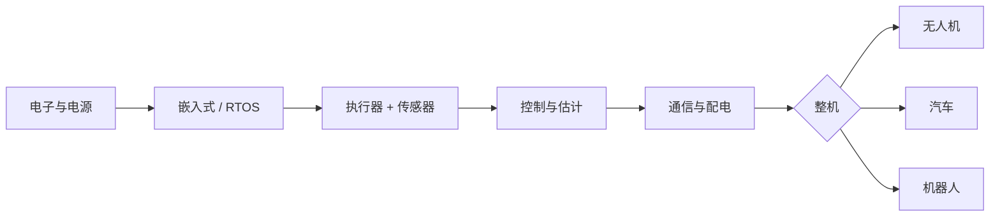

# 智能硬件：一条递进的脉络

目标不是一上来就「抄开源飞控焊板子」，而是把**知识排成台阶**：先能读懂电路与安全边界，再能在 MCU 上跑实时逻辑，最后才把多旋翼小车机械臂放进同一张系统图里。下面三张整机——**无人机、汽车、消费/工业机器人**——共享大半套底座（电、嵌入式、传感器、控制）；差异主要在**动力学、法规与系统可靠性**。

**侧栏结构**：**一级**为「总览 / 基础层 / 进阶层 / 整机脉络」。其中 **基础层** 含「六章专题」与 ①–⑥ 顺序；**进阶层** 含导读与 [完全精通路线](/zh/hardware/progression/roadmap)；**整机脉络** 下分三类整机，每类有**三级专题**。

---

## 三阶段总览

| 阶段 | 你在学什么 | 心智模型 |
|------|------------|----------|
| **底座（基础层）** | 电路、MCU、电机、IMU、PID、CAN/SPI | 「信号与能量怎么可靠流动」 |
| **扩展（进阶层）** | 数理/机械/算法/工程的自查地图与 11 层清单 | 「我还缺哪几块板凳」 |
| **集成为子系统** | 电调+桨、转向+制动、关节模组 | 「力与运动如何被计算并限幅」 |
| **整机（整机脉络）** | 飞控链路、域控与功能安全、臂/底盘 AGV | 「失效模式与法规/标准」 |

---

## 推荐阅读顺序（中文站内）

### 一级 · 基础层（二级目录）

1. [基础层导读](/zh/hardware/basics)  
2. [电路与电子](/zh/hardware/basics/electronics)  
3. [嵌入式与 MCU](/zh/hardware/basics/embedded)  
4. [执行器与动力](/zh/hardware/basics/actuation)  
5. [传感器与感知](/zh/hardware/basics/sensing)  
6. [控制与估计](/zh/hardware/basics/control)  
7. [总线与通信](/zh/hardware/basics/communication)  

### 一级 · 进阶层

1. [进阶层导读](/zh/hardware/progression)  
2. [完全精通路线](/zh/hardware/progression/roadmap)（11 层可勾选清单与对照表）  

### 一级 · 整机脉络（二级 + 三级）

- [整机导读](/zh/hardware/systems)  
- [无人机](/zh/hardware/systems/drones) → 机架 / 飞控 / 链路  
- [汽车](/zh/hardware/systems/automotive) → 网络 / 线控 / ADAS  
- [机器人](/zh/hardware/systems/robotics) → 机械臂 / 底盘 / 集成安全  

---

## 和本站其他版块怎么配合

- **编程基础**：[编程语言时间线](/zh/timeline)  
- **AI / 仿真实验**：[AI 模型](/zh/ais/overview)、[AI 数据集](/zh/datasets/overview)  
- **产业视角**：[科技巨头](/zh/companies/overview)  

---

## 现实主义备忘录

- **从小白到「能造出能转的样机」**：可行，周期以月计，重在迭代与测量。  
- **从小白到「可卖、可上路的商品」**：还涉及**供应链、测试、认证、功能安全**；本脉络先帮你把**工程语义**补齐，其余按产品目标再加模块。  

---

## 延伸阅读

英文镜像总览：[ /en/hardware/overview ](/en/hardware/overview)。
