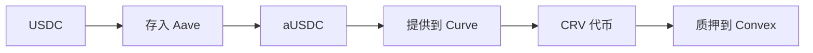

# 收益与衍生品

DeFi 提供超越基本借贷的复杂金融工具：优化收益的收益策略，以及提供杠杆和对冲的永续合约和期权。

---

## 收益耕作

收益耕作涉及战略性跨协议移动资产以最大化回报：

**收益来源：**
1. **借贷利息** — Aave, Compound
2. **交易费** — DEX LP 奖励
3. **流动性挖矿** — 协议代币激励
4. **质押奖励** — PoS 验证

---

## 质押衍生品

质押 ETH 锁定资产验证。**流动性质押**衍生品 (LSD) 提供流动性：

| 代币 | 协议 | 描述 |
|------|------|------|
| **stETH** | Lido | 1:1 质押 ETH |
| **rETH** | Rocket Pool | 市场利率 ETH |

---

## 永续合约

永续合约是无到期日的期货合约——DeFi 中最接近杠杆交易的方式。

| 协议 | 链 | 最大杠杆 |
|------|-----|----------|
| **dYdX** | Cosmos | 25x |
| **GMX** | Avalanche | 50x |

---

## 期权

期权赋予以设定价格买入/卖出的权利（非义务）：

| 类型 | 权利 | 买方支付 |
|------|------|----------|
| **看涨期权** | 以执行价买入 | 权利金 |
| **看跌期权** | 以执行价卖出 | 权利金 |