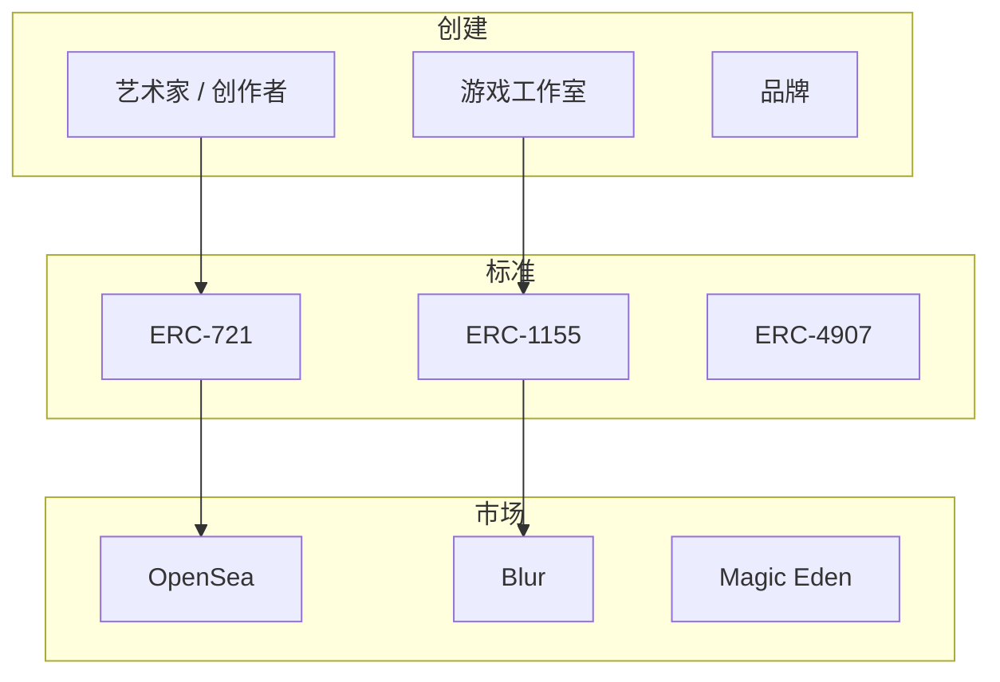

import { Cards } from 'nextra/components'

# NFT — 非同质化代币

NFT 代表具有区块链上可验证所有权的独特数字资产。虽然通常与数字艺术和收藏品相关，但技术扩展到游戏物品、现实世界资产代币化、身份凭证等。

---

## 主题

<Cards>
  <Cards.Card title="代币标准" href="/zh/web3/nft/standards" arrow>
    ERC-721, ERC-1155, ERC-4907
  </Cards.Card>
  <Cards.Card title="市场" href="/zh/web3/nft/marketplaces" arrow>
    OpenSea, Blur, Magic Eden
  </Cards.Card>
  <Cards.Card title="游戏与元宇宙" href="/zh/web3/nft/gaming" arrow>
    GameFi、虚拟世界、play-to-earn 经济
  </Cards.Card>
</Cards>

---

## NFT 生态系统

---

## 超越 JPEG

| 类别 | 代表 | 描述 |
|------|------|------|
| **PFP 项目** | BAYC, Azuki | 头像配社区访问 |
| **数字艺术** | Beeple, Art Blocks | 1/1 生成或策展艺术 |
| **音乐** | Catalog, Royal | 所有权和版税 |
| **游戏物品** | Axie, Gods Unchained | 游戏内资产 |
| **票务** | NFT 票务 | 活动访问，版税二次 |
| **现实世界资产** | RealT, Rally | 房产、奢侈品代币化 |

---

## 阅读下一步

- [智能合约语言](/zh/web3/languages) — NFT 如何实现
- [DAO 治理](/zh/web3/dao) — NFT 治理模型