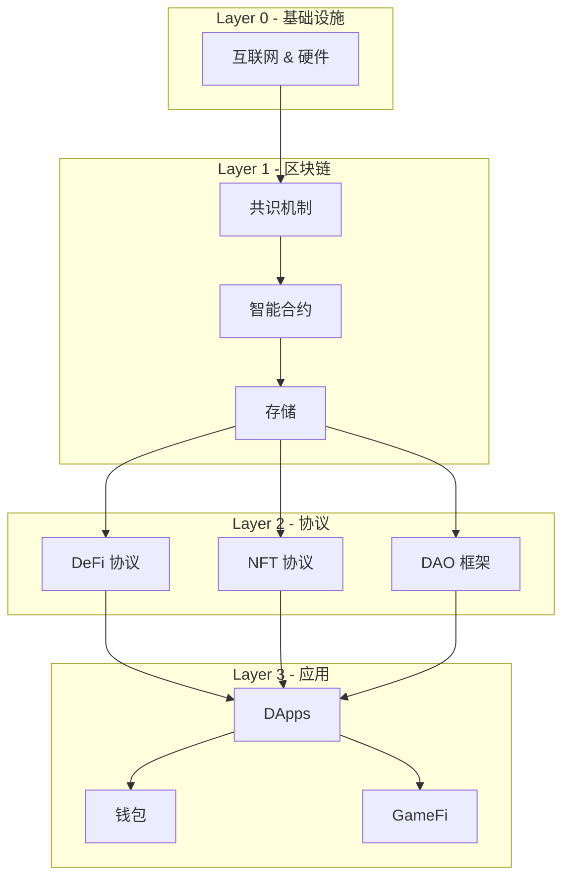

import { Cards } from 'nextra/components'

# Web3 — 从区块链基础到 DeFi、NFT 和 DAO

Web3 代表了互联网范式的转变——从中心化平台到去中心化、无需信任的协议。本章节涵盖完整技术栈：从加密学基础到去中心化应用（DApp）、金融协议（DeFi）、数字藏品（NFT）和去中心化治理（DAO）。

---

## 内容板块

| 板块 | 内容 |
|------|------|
| [基础知识](/zh/web3/basics) | 区块链基础、共识机制、密码学、钱包 |
| [智能合约语言](/zh/web3/languages) | Solidity、Rust、Move — 编写运行在区块链上的程序 |
| [DeFi](/zh/web3/defi) | 去中心化交易所、借贷协议、稳定币、收益聚合 |
| [NFT](/zh/web3/nft) | 代币标准、市场、游戏、数字所有权 |
| [DAO](/zh/web3/dao) | 治理机制、投票系统、国库管理 |
| [协议与生态](/zh/web3/protocols) | Ethereum、Solana、Layer 2、跨链桥 |

---

## Web3 技术栈

---

## 关键里程碑

| 年份 | 事件 | 意义 |
|------|------|------|
| **2008** | Bitcoin 白皮书 | 首个实用去中心化货币 |
| **2013** | Ethereum 白皮书 | 智能合约使可编程区块链成为可能 |
| **2015** | Ethereum 主网上线 | 首个通用智能合约平台 |
| **2020** | DeFi Summer | 金融协议爆发式增长 |
| **2021** | NFT 热潮 | 数字所有权进入主流 |
| **2022** | DAO 爆发 | 去中心化治理规模化 |
| **2023-2025** | Layer 2 扩容 | Rollups 为 Ethereum 带来可扩展性 |

---

## 与其他章节的关联

- **编程基础**: [编程语言时间线](/zh/timeline) — 包含 Solidity 的影响
- **共识 vs AI**: [AI 时间线](/zh/ai-timeline) — 去中心化 vs 中心化智能的平行轨道
- **数据与存储**: [数据集](/zh/datasets/overview) — 链上数据分析
- **硬件**: [智能硬件](/zh/hardware/overview) — 节点、矿机、物理基础设施 |

---

## 扩展阅读

English version: [ /en/web3/overview ](/en/web3/overview).